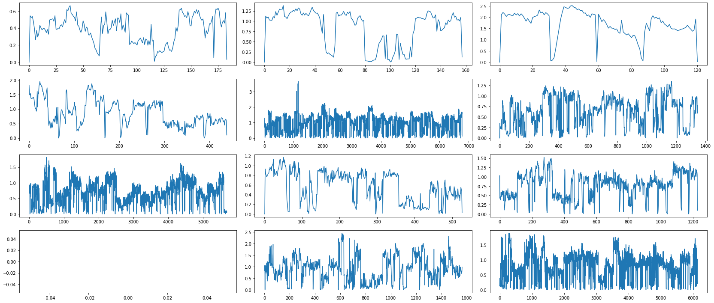

```python
!pip install pyarrow --user
```

    Requirement already satisfied: pyarrow in c:\users\jan\appdata\roaming\python\python310\site-packages (7.0.0)
    Requirement already satisfied: numpy>=1.16.6 in c:\users\jan\appdata\local\programs\python\python310\lib\site-packages (from pyarrow) (1.22.3)
    


```python
import pandas as pd
import numpy as np
import pyarrow.parquet as pq
from matplotlib import pyplot as plt
from math import floor
```

# loading `data.parquet` file
First we load data and get some information from it, to get basic understanding and general view on the data.


```python
df = pq.read_table('data/data.parquet').to_pandas()
```

now lets look on columns, whether they match github description:


```python
df.columns
```


    Index(['MachineId', 'MeasurementId', 'Pressure'], dtype='object')


Column `MachineId` represents one machine as mentioned on github.
I want to understand what is meant by definition of _MeasurementId_ column, which says _MeasurementId - Id of the measured cycle_. There are multiple possible ways how to understand it, so I will test two that seems most probable:
 - Does one `measured cycle` represents one measurement of one machine cycle?
 - Does one `measured cycle` represents complete measurement of one machine cycle?
 
Let's take a look at some example `MachineId` and check how many rows we have for it:


```python
df['MachineId'].unique()[:5]
```


    array(['0_0_0', '0_0_1', '0_0_2', '0_0_3', '0_1_0'], dtype=object)


```python
df[df['MachineId'] == '0_0_0']
```


<div>
<style scoped>
    .dataframe tbody tr th:only-of-type {
        vertical-align: middle;
    }

    .dataframe tbody tr th {
        vertical-align: top;
    }

    .dataframe thead th {
        text-align: right;
    }
</style>
<table border="1" class="dataframe">
  <thead>
    <tr style="text-align: right;">
      <th></th>
      <th>MachineId</th>
      <th>MeasurementId</th>
      <th>Pressure</th>
    </tr>
  </thead>
  <tbody>
    <tr>
      <th>0</th>
      <td>0_0_0</td>
      <td>0</td>
      <td>0.0</td>
    </tr>
    <tr>
      <th>1</th>
      <td>0_0_0</td>
      <td>0</td>
      <td>0.0</td>
    </tr>
    <tr>
      <th>2</th>
      <td>0_0_0</td>
      <td>0</td>
      <td>0.0</td>
    </tr>
    <tr>
      <th>3</th>
      <td>0_0_0</td>
      <td>0</td>
      <td>0.0</td>
    </tr>
    <tr>
      <th>4</th>
      <td>0_0_0</td>
      <td>0</td>
      <td>0.0</td>
    </tr>
    <tr>
      <th>...</th>
      <td>...</td>
      <td>...</td>
      <td>...</td>
    </tr>
    <tr>
      <th>18226173</th>
      <td>0_0_0</td>
      <td>8724</td>
      <td>0.0</td>
    </tr>
    <tr>
      <th>18226174</th>
      <td>0_0_0</td>
      <td>8724</td>
      <td>0.0</td>
    </tr>
    <tr>
      <th>18226175</th>
      <td>0_0_0</td>
      <td>8724</td>
      <td>0.0</td>
    </tr>
    <tr>
      <th>18226176</th>
      <td>0_0_0</td>
      <td>8724</td>
      <td>0.0</td>
    </tr>
    <tr>
      <th>18226177</th>
      <td>0_0_0</td>
      <td>8724</td>
      <td>0.0</td>
    </tr>
  </tbody>
</table>
<p>365338 rows × 3 columns</p>
</div>


__So there are two possible scenarios__

 1. From what we see above, it seems that one `MeasurementId` could represent one single measurement of machine cycle (thus _measured cycle_ in _Id of the measured cycle_ is not the same as _machine cycle_), as there is a lot of `MeasurementId`s. However, that would mean, that dataset has some duplicated rows, as they have all columns same.
 2. Another scenario, could be in such way, that one row represents one technical measurement, and that _measured cycle_ is the same as _machine cycle_. In that case, it's weird that each single measurement does not have its on ID, so we must rely on rows order. 
 
Also, after quick look into `labels.csv` file, it has less than 30k rows. So if we are going to test first scenario, it means, that lot of data (single measurements) are missing in `labels.csv` and that _Slow start_ and _Slow end_ columns represents whether the single measurement happened during slow start or slow end (or nothing).

In case of the second scenario, `labels.csv` file could be ok.

Let's drop duplicates and try to plot data, to see whether correct understanding could be the first way (i.e. one `MeasurementId` represents single measurement of _machine cycle_ which consits of multiple `MeasurementId`s):

# Testing first way - suppose that `MeasurementId` represents single measurement


```python
df = df.drop_duplicates().reset_index()
```

## Let's get some sample of the data and plot it
As this dataset is time series with main focus on pressure changing in time (according to task description), we will firstly plot pressure in time, over the individual measurements on some randomly chosen machines


```python
sample_charts_machines = np.random.choice(df['MachineId'].unique(), 12, replace=False)
sample_charts_machines
```


    array(['71_0_0', '38_2_3', '76_2_2', '57_1_3', '6_0_1', '36_2_1',
           '17_2_3', '21_2_1', '40_2_2', '56_2_0', '26_2_3', '7_2_2'],
          dtype=object)


According to the description, measure ID represents <i>Id of the measured cycle</i>. Above we saw measure IDs are integer numeric vales. So, in __this chart__ let's suppose these values represents order, in which measurements were done, but not the time difference between them. That means, that if we have IDs `[0,1,2,6,7,8]` for machine `x`, time between each measurement is same, although their difference isn't.


```python
fig, charts = plt.subplots(nrows=4, ncols=3, figsize=(23,10))
plt.tight_layout()

#make charts flat array (as rows vs cols have no meaning, it's just for visualizing more on smaller space)
charts = [chart for row in charts for chart in row]

for idx,chart in enumerate(charts):
    measurements = df[df['MachineId'] == sample_charts_machines[idx]].sort_values(by='MeasurementId')[['Pressure','MeasurementId']]
    chart.plot(range(len(measurements['MeasurementId'])),measurements['Pressure'], linestyle='-')
    
plt.show()
```


    

    


Now we will repeat the same visualization as above, but we will assume that measurement ID represents also time difference, so on _x_ axis, we place measurements IDs directly, and we can expect some empty space (when some measurements were missing for given machine):


```python
fig, charts = plt.subplots(nrows=4, ncols=3, figsize=(23,10))
plt.tight_layout()

#make charts flat array (as rows vs cols have no meaning, it's just for visualizing more on smaller space)
charts = [chart for row in charts for chart in row]

for idx,chart in enumerate(charts):
    measurements = df[df['MachineId'] == sample_charts_machines[idx]].sort_values(by='MeasurementId')[['Pressure','MeasurementId']]
    chart.plot(measurements['MeasurementId'],measurements['Pressure'], linestyle='-')
    
plt.show()
```


    

    


We see this is very 1) different from first visualization, 2) ugly, as there is A LOT of missing measurements IDs for each machine. However, we still don't know which interpretation from two sets of charts is correct, and whether the basic assumption (one `MeasurementId` represents single measurement) is correct

So it is possible that our initial interpretation that each measurement ID corresponds to exactly one measurement, is wrong. That would mean that measurement ID represents full process of multiple measurements.

That would mean following:
 - that we need to rely just on rows order, as there is no unique identifier
 - and that we cannot deduplicate rows, as it is possible that two rows represents two actual measurements, with one measurement ID (and pressure was same --> rows were completely identical)
 
Let's test whether there are some rows where measurement ID and machine ID are same, but pressure is different:


```python
len(df[['MeasurementId','MachineId']].drop_duplicates())
```


    27385


```python
len(df[['MeasurementId','MachineId','Pressure']].drop_duplicates())
```


    4010530


From this we can see that initial interpreation was wrong. One row actually represents one measurement, but one `MeasurementId` represents full _machine cycle_, consisting from multiple measurements. So let's test the second understanding in next chapter.

# Testing second way - suppose that `MeasurementId` represents full measurement of _machine cycle_
...and that individual measurements are represented just by rows in given order


```python
df = pq.read_table('data/data.parquet').to_pandas()
```

We reloaded dataset and now we will load also labels file


```python
labels = pd.read_csv('data/labels.csv')
labels
```


<div>
<style scoped>
    .dataframe tbody tr th:only-of-type {
        vertical-align: middle;
    }

    .dataframe tbody tr th {
        vertical-align: top;
    }

    .dataframe thead th {
        text-align: right;
    }
</style>
<table border="1" class="dataframe">
  <thead>
    <tr style="text-align: right;">
      <th></th>
      <th>MachineId</th>
      <th>MeasurementId</th>
      <th>PumpFailed</th>
      <th>SlowStart</th>
      <th>SlowEnd</th>
    </tr>
  </thead>
  <tbody>
    <tr>
      <th>0</th>
      <td>0_0_0</td>
      <td>0</td>
      <td>False</td>
      <td>False</td>
      <td>False</td>
    </tr>
    <tr>
      <th>1</th>
      <td>0_0_1</td>
      <td>-1</td>
      <td>NaN</td>
      <td>NaN</td>
      <td>NaN</td>
    </tr>
    <tr>
      <th>2</th>
      <td>0_0_2</td>
      <td>0</td>
      <td>False</td>
      <td>False</td>
      <td>False</td>
    </tr>
    <tr>
      <th>3</th>
      <td>0_0_3</td>
      <td>0</td>
      <td>True</td>
      <td>False</td>
      <td>False</td>
    </tr>
    <tr>
      <th>4</th>
      <td>0_1_0</td>
      <td>-1</td>
      <td>NaN</td>
      <td>NaN</td>
      <td>NaN</td>
    </tr>
    <tr>
      <th>...</th>
      <td>...</td>
      <td>...</td>
      <td>...</td>
      <td>...</td>
      <td>...</td>
    </tr>
    <tr>
      <th>27380</th>
      <td>10_0_2</td>
      <td>8833</td>
      <td>False</td>
      <td>False</td>
      <td>False</td>
    </tr>
    <tr>
      <th>27381</th>
      <td>10_0_3</td>
      <td>8833</td>
      <td>False</td>
      <td>False</td>
      <td>False</td>
    </tr>
    <tr>
      <th>27382</th>
      <td>10_0_0</td>
      <td>8834</td>
      <td>False</td>
      <td>False</td>
      <td>False</td>
    </tr>
    <tr>
      <th>27383</th>
      <td>10_0_1</td>
      <td>8834</td>
      <td>False</td>
      <td>False</td>
      <td>True</td>
    </tr>
    <tr>
      <th>27384</th>
      <td>10_0_3</td>
      <td>8834</td>
      <td>False</td>
      <td>False</td>
      <td>False</td>
    </tr>
  </tbody>
</table>
<p>27385 rows × 5 columns</p>
</div>


As we can see, labels have same number of rows, as there is unique rows in dataset file, when unique row is based on `MeasurementId` and `MachineId` columns. This can actually mean, that second assumption is correct, and that __one MeasurementId represents full machine cycle, and individual measurements are represented by rows__.

So let's try to plot charts or randomly selected machine cycles. We will selected several machines and several measurements cycles for each machine

## Sample data selection


```python
sample_charts_machines = np.random.choice(df['MachineId'].unique(), 40, replace=False) #select first some MachineIds -> so that later we will select only measurements Ids that were run for given machine Id (there are gaps in measurement Ids)
df_sample_machines = df[df['MachineId'].isin(sample_charts_machines)]
```

lets show measurements we have for each of selected machines


```python
df_sample_machines.groupby('MachineId').aggregate({'MeasurementId': lambda x: set(x)})
```


<div>
<style scoped>
    .dataframe tbody tr th:only-of-type {
        vertical-align: middle;
    }

    .dataframe tbody tr th {
        vertical-align: top;
    }

    .dataframe thead th {
        text-align: right;
    }
</style>
<table border="1" class="dataframe">
  <thead>
    <tr style="text-align: right;">
      <th></th>
      <th>MeasurementId</th>
    </tr>
    <tr>
      <th>MachineId</th>
      <th></th>
    </tr>
  </thead>
  <tbody>
    <tr>
      <th>0_0_0</th>
      <td>{0, 2052, 8199, 8209, 2074, 8251, 6217, 6218, ...</td>
    </tr>
    <tr>
      <th>11_2_2</th>
      <td>{4811, -1, 1367}</td>
    </tr>
    <tr>
      <th>14_0_1</th>
      <td>{2560, 2561, 2562, 2056, 2571, 4627, 4628, 462...</td>
    </tr>
    <tr>
      <th>15_2_0</th>
      <td>{1260, -1}</td>
    </tr>
    <tr>
      <th>15_3_3</th>
      <td>{1048, -1}</td>
    </tr>
    <tr>
      <th>16_2_2</th>
      <td>{-1}</td>
    </tr>
    <tr>
      <th>17_0_0</th>
      <td>{1155, 8707, 1158, 1160, 1165, 1166, 1172, 181...</td>
    </tr>
    <tr>
      <th>17_2_1</th>
      <td>{1174, 1175, 1177, 1184, 1194, 1219, 1221, 878...</td>
    </tr>
    <tr>
      <th>1_0_2</th>
      <td>{3584, 3585, 3591, 2572, 1039, 1042, 3611, 361...</td>
    </tr>
    <tr>
      <th>20_3_0</th>
      <td>{-1}</td>
    </tr>
    <tr>
      <th>20_3_1</th>
      <td>{-1}</td>
    </tr>
    <tr>
      <th>22_0_1</th>
      <td>{-1}</td>
    </tr>
    <tr>
      <th>22_0_2</th>
      <td>{8232}</td>
    </tr>
    <tr>
      <th>22_1_3</th>
      <td>{1351}</td>
    </tr>
    <tr>
      <th>22_3_1</th>
      <td>{8233, -1}</td>
    </tr>
    <tr>
      <th>25_2_3</th>
      <td>{3840, 2177, 3842, 2179, 3843, 3844, 2182, 219...</td>
    </tr>
    <tr>
      <th>28_2_3</th>
      <td>{2573, 2582, 2584, 1946, 2590, 2466, 4259, 426...</td>
    </tr>
    <tr>
      <th>29_0_1</th>
      <td>{4342, -1}</td>
    </tr>
    <tr>
      <th>2_2_0</th>
      <td>{3, 15, 1040, 17, 18, 20, 1050, 27, 1062, 1065...</td>
    </tr>
    <tr>
      <th>32_0_1</th>
      <td>{2995, -1}</td>
    </tr>
    <tr>
      <th>33_1_2</th>
      <td>{2944, 4353, 4354, 4355, 4356, 2186, 2957, 295...</td>
    </tr>
    <tr>
      <th>34_0_0</th>
      <td>{2219}</td>
    </tr>
    <tr>
      <th>36_2_1</th>
      <td>{4393, 2859, -1}</td>
    </tr>
    <tr>
      <th>41_0_1</th>
      <td>{2759}</td>
    </tr>
    <tr>
      <th>46_2_0</th>
      <td>{2963, -1}</td>
    </tr>
    <tr>
      <th>50_0_0</th>
      <td>{-1}</td>
    </tr>
    <tr>
      <th>50_0_1</th>
      <td>{-1}</td>
    </tr>
    <tr>
      <th>53_4_2</th>
      <td>{-1}</td>
    </tr>
    <tr>
      <th>56_0_1</th>
      <td>{2836, -1}</td>
    </tr>
    <tr>
      <th>59_0_0</th>
      <td>{2890, 4371, 4373, 4375, 4376, 2877, -1}</td>
    </tr>
    <tr>
      <th>67_2_2</th>
      <td>{3096}</td>
    </tr>
    <tr>
      <th>73_3_1</th>
      <td>{-1}</td>
    </tr>
    <tr>
      <th>74_3_0</th>
      <td>{-1}</td>
    </tr>
    <tr>
      <th>76_2_0</th>
      <td>{-1}</td>
    </tr>
    <tr>
      <th>78_0_0</th>
      <td>{-1}</td>
    </tr>
    <tr>
      <th>79_0_0</th>
      <td>{-1}</td>
    </tr>
    <tr>
      <th>79_0_3</th>
      <td>{-1}</td>
    </tr>
    <tr>
      <th>7_0_2</th>
      <td>{2678, -1}</td>
    </tr>
    <tr>
      <th>7_1_3</th>
      <td>{2218, -1, 4383}</td>
    </tr>
    <tr>
      <th>7_4_0</th>
      <td>{2753, 2564, 2604, 2606, 2610, 2612, 2644, 271...</td>
    </tr>
  </tbody>
</table>
</div>


Ok so we will select ideally 3 random measurements for each machine. If it has less, we select less. In previous step, we could also select only machines with at least 3 measurements, but it could introduce bias in data (e.g., what if less/more measured machines are less/more faulty?). Lets put this into dictionary format and with added list of measurements ids for each machine:


```python
print(df_sample_machines.groupby('MachineId').aggregate({'MeasurementId':lambda x: set(x)}).rename({'MeasurementId':'measurements'},axis=1).to_dict(orient='index'))
```

    {'0_0_0': {'measurements': {0, 2052, 8199, 8209, 2074, 8251, 6217, 6218, 6221, 6224, 6229, 2135, 8291, 2148, 7982, 8301, 2163, 6262, 6263, 2168, 6264, 6268, 6269, 6270, 2196, 2198, 2204, 2213, 8359, 2216, 6315, 6316, 2232, 2238, 8387, 8389, 8392, 8393, 8395, 8397, 8398, 8399, 2260, 215, 8407, 2270, 8414, 8416, 8420, 8422, 8425, 237, 8429, 8434, 8436, 8190, 8441, 8444, 2318, 8482, 2343, 8487, 2347, 8492, 2355, 8499, 8500, 6458, 6460, 6461, 6467, 6468, 6469, 6472, 6478, 6485, 6495, 353, 2412, 2425, 2452, 2455, 2457, 411, 412, 8610, 421, 2470, 2471, 2472, 8613, 428, 430, 441, 2518, 476, 478, 487, 2537, 507, 517, 2566, 2576, 8724, 2596, 2601, 2646, 2654, 657, 667, 671, 2720, 675, 676, 2728, 4781, 698, 699, 2751, 716, 4812, 4813, 731, 4830, 735, 2783, 738, 4837, 2791, 749, 4852, 4856, 2813, 2841, 2885, 2887, 854, 2917, 898, 905, 2953, 907, 2961, 2967, 2979, 2984, 3002, 3010, 963, 980, 988, 7931, 3054, 7937, 7938, 3091, 3097, 3106, 7945, 7946, 3119, 7947, 7948, 7949, 3131, 7950, 3136, 5193, 7952, 1120, 1125, 3173, 7959, 5233, 7960, 3188, 1142, 1152, 1153, 1162, 1183, 7970, 7340, 7341, 7345, 7346, 7347, 7348, 7349, 7350, 7351, 7352, 7353, 3264, 7374, 7375, 7376, 7378, 7379, 7380, 1237, 1238, 3286, 7381, 7382, 7383, 7384, 7385, 7386, 7387, 7388, 1248, 7389, 7390, 7391, 7392, 3301, 7393, 7394, 7395, 7396, 7397, 7398, 3308, 7399, 7400, 7401, 7402, 7403, 7404, 7405, 7406, 7407, 7409, 7410, 7411, 7986, 7995, 3366, 3368, 3371, 3383, 3395, 3397, 3447, 1404, 1407, 7566, 7567, 7568, 7569, 7570, 3475, 7571, 7572, 7573, 7574, 7575, 7576, 7577, 7578, 7579, 7580, 3486, 3487, 3488, 7581, 7582, 7583, 7584, 7585, 7586, 7587, 7588, 3497, 7589, 7590, 7591, 7592, 7593, 7594, 7595, 7596, 7597, 7598, 7599, 7600, 7601, 7602, 7603, 7604, 7605, 7606, 7607, 3517, 7608, 7609, 3520, 7611, 7612, 3523, 7613, 7614, 7615, 3529, 7627, 1484, 7628, 7629, 7630, 7631, 7632, 3538, 7633, 7634, 7635, 7636, 7637, 3544, 7638, 3546, 7639, 7640, 7641, 7642, 7643, 7644, 1505, 7650, 3555, 1514, 3563, 1520, 7668, 1527, 7671, 1530, 7680, 1544, 7693, 7694, 7696, 7704, 7705, 3610, 7707, 3613, 7710, 7711, 7712, 3632, 1592, 1593, 1596, 1597, 3649, 1604, 1605, 1606, 1609, 1610, 1611, 7754, 7755, 1619, 7780, 3700, 3704, 7805, 1666, 7812, 7822, 3739, 7860, 7867, 1724, 1725, 7868, 1727, 7873, 7874, 7875, 7884, 7885, 7897, 1754, 7904, 7906, 7907, 7908, 7909, 7910, 7911, 7912, 7914, 1779, 5878, 5879, 5880, 5881, 5882, 5883, 5884, 5885, 5886, 5887, 5888, 5889, 5890, 5891, 5892, 1797, 5893, 5894, 5895, 5896, 5897, 5899, 5900, 5901, 1806, 1807, 5902, 5903, 5904, 5905, 5906, 5909, 5910, 5911, 7951, 5913, 5914, 5915, 1820, 5916, 5917, 5918, 5919, 5920, 5921, 5922, 5923, 5924, 5925, 5926, 5927, 5928, 5930, 5929, 5931, 5932, 5934, 5933, 5935, 5936, 5937, 5938, 5940, 5939, 5941, 5942, 5943, 5944, 5946, 5945, 5948, 5949, 5950, 5951, 1853, 5947, 5952, 5953, 5954, 5955, 5956, 5957, 1864, 5958, 5959, 5960, 5961, 5965, 5962, 5963, 5964, 5966, 5967, 5968, 5969, 5970, 5971, 8014, 8025, 5983, 5984, 5985, 5986, 5991, 5992, 5993, 5994, 5995, 5996, 5997, 5998, 5999, 6000, 6001, 6002, 6003, 6004, 6006, 6007, 6008, 6009, 6010, 6011, 6012, 6013, 6014, 6015, 6016, 6017, 6018, 6019, 6020, 6021, 8063, 8064, 8076, 6046, 8120, 8125, 8126, 1991, 1995, 8140, 8143, 8146, 6102, 6103, 6104, 8150, 6109, 6110, 6111, 6112, 6113, 8168, 8169, 6123, 6124, 6125, 6126, 6127, 6128, 6129, 6130, 6131, 6132, 6133, 6134, 6135, 6136, 6137, 6138, 6139, -1}}, '11_2_2': {'measurements': {4811, -1, 1367}}, '14_0_1': {'measurements': {2560, 2561, 2562, 2056, 2571, 4627, 4628, 4629, 4630, 4631, 4632, 4633, 4634, 4635, 4637, 4640, 2593, 4641, 4642, 4643, 4647, 4651, 4652, 4653, 4654, 4655, 4656, 4657, 4658, 4659, 4660, 4661, 4662, 4663, 4664, 4665, 4666, 4667, 4668, 4670, 4671, 4673, 4688, 4689, 4693, 4700, 4701, 4702, 4704, 4707, 4715, 4727, 4728, 4729, 4731, 8319, 8321, 8322, 8323, 8324, 4748, 4750, 4751, 4752, 4753, 4754, 4755, 4757, 4758, 8352, 3240, 3241, 3246, 3247, 4795, 4796, 4801, 1748, 3293, 3294, 3806, 3807, 3297, 3808, 3299, 3300, 3809, 3810, 3811, 3812, 3813, 3814, 3815, 3816, 3817, 3818, 3819, 3820, 3821, 3822, 3823, 3826, 3829, 3830, 2294, 3827, 3833, 3834, 3835, 3836, 3837, 2298, 2299, 2332, 2337, 2341, 2352, 3828, 4847, 3934, 3935, 3936, 3937, 3938, 3939, 1891, 3941, 3942, 3943, 3944, 3945, 3946, 3947, 3948, 3949, 3950, 3951, 3952, 3953, 3954, 3955, 3956, 3957, 3958, 3959, 3960, 3961, 3962, 3963, 1916, 3964, 3965, 1919, 3966, 3968, 3969, 3971, 3972, 3973, 3974, 3975, 3976, 3977, 3979, 3980, 3981, 3982, 3983, 3985, 3986, 3987, 3988, 3989, 2454, 3990, 3991, 2504, 2505, 2511, 1495, 2021, 2540, -1, 2047}}, '15_2_0': {'measurements': {1260, -1}}, '15_3_3': {'measurements': {1048, -1}}, '16_2_2': {'measurements': {-1}}, '17_0_0': {'measurements': {1155, 8707, 1158, 1160, 1165, 1166, 1172, 1815, 1818, 1821, 1182, 1827, 1828, 1829, 8787, 8788, 8789, 8790, 8791, 8792, 8793, 8794, 8795, 8797, 8799, 8800, 8801, 1379, 8803, 8804, 8805, 8813, -1}}, '17_2_1': {'measurements': {1174, 1175, 1177, 1184, 1194, 1219, 1221, 8786, 8695, 1126, 8807, 8696, 1129, 1130, 8810, 1132, 8811, 8812, 8815, 8698, 1139, 1140, 1395, 8693, -1, 8694, 8697, 1146, 1149, 1406}}, '1_0_2': {'measurements': {3584, 3585, 3591, 2572, 1039, 1042, 3611, 3612, 551, 553, 560, 2099, 568, 3645, 574, 3650, 7746, 585, 4683, 2637, 2640, 4690, 3155, 4691, 4692, 1110, 4694, 1112, 3164, 3167, 1121, 3684, 3582, 3187, 5237, 1145, 1659, 1150, 4739, 4745, 2187, 3735, 4763, 1187, 167, 168, 169, 681, 680, 4789, 182, 2743, 1721, 2745, 708, 2758, 1751, 2269, 741, 4844, 1773, 750, 4845, 3313, 754, 4850, 244, 245, 2304, 4868, 4869, 5385, 1294, 2321, 3352, 794, 795, 4893, 4895, 1825, 1330, 1331, 1339, 1343, 3402, 1371, 2908, 8037, 360, 3433, 362, 363, 2410, 3434, 2928, 3440, 3441, 1424, 1936, 1937, 3483, 3485, 2463, 8096, 2469, 8102, 1959, 8103, 1465, 3514, 1472, 2501, 8134, 3535, 2003, 3032, 1504, 8162, 8163, 1006, 2543, -1}}, '20_3_0': {'measurements': {-1}}, '20_3_1': {'measurements': {-1}}, '22_0_1': {'measurements': {-1}}, '22_0_2': {'measurements': {8232}}, '22_1_3': {'measurements': {1351}}, '22_3_1': {'measurements': {8233, -1}}, '25_2_3': {'measurements': {3840, 2177, 3842, 2179, 3843, 3844, 2182, 2192, 2193, 3858, 3860, 3861, 3862, 3863, 3864, 2112, 2240, 2245, 2250, 2255, 2136, 2141, 2150, -1, 3839}}, '28_2_3': {'measurements': {2573, 2582, 2584, 1946, 2590, 2466, 4259, 4260, 4261, 4262, 4263, 4264, 4265, 4267, 4269, 4270, 4274, 4275, 4276, 4277, 4278, 4279, 4280, 4281, 4282, 4283, 4284, 2493, 2494, 4285, 4286, 4288, 4291, 4292, 4293, 4294, 4295, 4296, 4297, 4298, 4299, 4300, 4301, 2510, 4303, 2515, 2523, 2528, 4320, 4321, 2532, 4324, 4325, 4326, 2280, 2039, 2043, -1}}, '29_0_1': {'measurements': {4342, -1}}, '2_2_0': {'measurements': {3, 15, 1040, 17, 18, 20, 1050, 27, 1062, 1065, 8263, 8264, 8265, 8266, 1099, 8267, 1101, 8270, 8269, 1104, 1105, 8273, 8274, 84, 1108, 86, 1111, 8275, 8279, 8280, 8281, 8282, 8283, 94, 8284, 8285, 8286, 8287, 8292, 8293, 8294, 8295, 8296, 8297, 8337, 7839, 8363, 8385, 8466, 8467, 8469, 8480, 839, 8524, 8525, 844, 1869, 860, 8554, 8555, 8558, 8559, 8560, 8561, 8564, 8565, 8571, 8572, 8584, 8607, 8608, 8614, 8615, 8619, 435, 8628, 8629, 8630, 8631, 8632, 8633, 8634, 8636, 8637, 8638, 8639, 8640, 8641, 8642, 8643, 8644, 8645, 8647, 8648, 8649, 8650, 8651, 8654, 8655, 8656, 8658, 8659, 8660, 8661, 8662, 8663, 8664, -1, 1535}}, '32_0_1': {'measurements': {2995, -1}}, '33_1_2': {'measurements': {2944, 4353, 4354, 4355, 4356, 2186, 2957, 2959, 2973, 2207, 2992, 4400, 2994, 4402, 4404, 3125, 2230, 4405, 4406, 3001, 4407, 4408, 4409, 4410, 4411, 4412, 4413, 4289, 4290, 4414, 4415, 4416, 4418, 4419, 3016, 4420, 4422, 2251, 4423, 4425, 4426, 4427, 4428, 4429, 4430, 4431, 4432, 4433, 4434, 4435, 4436, 4437, 4438, 4439, 4440, 4441, 4442, 2271, 2144, 4443, 4444, 4446, 4447, 4448, 4449, 4450, 2920, 2155, 2923, 2931, 2934, 3062, -1}}, '34_0_0': {'measurements': {2219}}, '36_2_1': {'measurements': {4393, 2859, -1}}, '41_0_1': {'measurements': {2759}}, '46_2_0': {'measurements': {2963, -1}}, '50_0_0': {'measurements': {-1}}, '50_0_1': {'measurements': {-1}}, '53_4_2': {'measurements': {-1}}, '56_0_1': {'measurements': {2836, -1}}, '59_0_0': {'measurements': {2890, 4371, 4373, 4375, 4376, 2877, -1}}, '67_2_2': {'measurements': {3096}}, '73_3_1': {'measurements': {-1}}, '74_3_0': {'measurements': {-1}}, '76_2_0': {'measurements': {-1}}, '78_0_0': {'measurements': {-1}}, '79_0_0': {'measurements': {-1}}, '79_0_3': {'measurements': {-1}}, '7_0_2': {'measurements': {2678, -1}}, '7_1_3': {'measurements': {2218, -1, 4383}}, '7_4_0': {'measurements': {2753, 2564, 2604, 2606, 2610, 2612, 2644, 2710, 2554, 2621, -1}}}
    

now we will select individual measurements


```python
selected = []
for m in sample_charts_machines:
    measurements_this_machine = df_sample_machines.groupby('MachineId').aggregate({'MeasurementId':lambda x: set(x)}).rename({'MeasurementId':'measurements'},axis=1).to_dict(orient='index')[m]['measurements']
    num_selected_measurements = min(3,len(measurements_this_machine)) #if possible, select ideally 3 measurements
    selected_measurements = np.random.choice(list(measurements_this_machine), num_selected_measurements, replace=False) #now we select only relevant measurements ids to already selected machine Ids
    selected.append({'machine_id':m, 'measurements':selected_measurements})

selected
```


    [{'machine_id': '22_1_3', 'measurements': array([1351])},
     {'machine_id': '2_2_0', 'measurements': array([8263, 8648, 8660])},
     {'machine_id': '22_0_2', 'measurements': array([8232])},
     {'machine_id': '15_2_0', 'measurements': array([1260,   -1])},
     {'machine_id': '50_0_0', 'measurements': array([-1])},
     {'machine_id': '53_4_2', 'measurements': array([-1])},
     {'machine_id': '15_3_3', 'measurements': array([  -1, 1048])},
     {'machine_id': '50_0_1', 'measurements': array([-1])},
     {'machine_id': '36_2_1', 'measurements': array([2859,   -1, 4393])},
     {'machine_id': '41_0_1', 'measurements': array([2759])},
     {'machine_id': '14_0_1', 'measurements': array([2511, 4751, 3958])},
     {'machine_id': '46_2_0', 'measurements': array([  -1, 2963])},
     {'machine_id': '20_3_1', 'measurements': array([-1])},
     {'machine_id': '7_4_0', 'measurements': array([2644, 2621, 2604])},
     {'machine_id': '11_2_2', 'measurements': array([  -1, 1367, 4811])},
     {'machine_id': '7_1_3', 'measurements': array([  -1, 4383, 2218])},
     {'machine_id': '76_2_0', 'measurements': array([-1])},
     {'machine_id': '56_0_1', 'measurements': array([  -1, 2836])},
     {'machine_id': '22_0_1', 'measurements': array([-1])},
     {'machine_id': '7_0_2', 'measurements': array([  -1, 2678])},
     {'machine_id': '74_3_0', 'measurements': array([-1])},
     {'machine_id': '34_0_0', 'measurements': array([2219])},
     {'machine_id': '22_3_1', 'measurements': array([8233,   -1])},
     {'machine_id': '1_0_2', 'measurements': array([2640, 3155, 2758])},
     {'machine_id': '79_0_3', 'measurements': array([-1])},
     {'machine_id': '79_0_0', 'measurements': array([-1])},
     {'machine_id': '29_0_1', 'measurements': array([  -1, 4342])},
     {'machine_id': '59_0_0', 'measurements': array([2877,   -1, 4371])},
     {'machine_id': '73_3_1', 'measurements': array([-1])},
     {'machine_id': '16_2_2', 'measurements': array([-1])},
     {'machine_id': '17_2_1', 'measurements': array([8694, 1130, 1219])},
     {'machine_id': '17_0_0', 'measurements': array([1821, 8793, 8799])},
     {'machine_id': '25_2_3', 'measurements': array([3861, 3863, 3860])},
     {'machine_id': '67_2_2', 'measurements': array([3096])},
     {'machine_id': '32_0_1', 'measurements': array([  -1, 2995])},
     {'machine_id': '33_1_2', 'measurements': array([2931, 4422, 4439])},
     {'machine_id': '20_3_0', 'measurements': array([-1])},
     {'machine_id': '0_0_0', 'measurements': array([5915, 6218, 1152])},
     {'machine_id': '78_0_0', 'measurements': array([-1])},
     {'machine_id': '28_2_3', 'measurements': array([4279, 4321, 4292])}]


## Plotting charts
Now when we have selected machines and measurements, we will plot charts


```python
fig, charts = plt.subplots(nrows=40, ncols=3, figsize=(23,50))
temp_df = df[df['MachineId'].isin(sample_charts_machines)]

for machidx, mach in enumerate(selected):
    for measidx, meas in enumerate(mach['measurements']):
        pressure = temp_df[(temp_df['MachineId'] == mach['machine_id']) & (temp_df['MeasurementId'] == meas)]['Pressure']
        chart = charts[machidx][measidx]
        chart.plot(range(len(pressure)), pressure)
        chart.set_title(f"machine: {mach['machine_id']}, measurement: {meas}")

plt.tight_layout()        
```


    

    


Charts above seems to be reasonable. But we would also need to see labels corresponding to each measure (whether pump failed).

The purpose of that, is to check if we can visually disntiguish pump failure and ideally get some understanding of _how pump failure looks like_, so that we can decide whether a model should be built, or whether we may try some heuristic first


```python
#joining not necessary
#temp_df_labels = temp_df.merge(labels, how='inner', left_on=['MachineId','MeasurementId'], right_on=['MachineId','MeasurementId'])
#temp_df_labels
```

## Plotting charts together with labels
Here we add labels to charts, they will be represented in form of colours


```python
import math
```


```python
fig, charts = plt.subplots(nrows=40, ncols=3, figsize=(23,50))
pumpFailedColors = {True:'red',False:'blue','nan':'gray'}

for machidx, mach in enumerate(selected):
    for measidx, meas in enumerate(mach['measurements']):
        pumpFailed = labels[(labels['MachineId'] == mach['machine_id']) & (labels['MeasurementId'] == meas)]['PumpFailed']
        if len(pumpFailed) > 1:
            raise Exception('only one label of `PumpFailed` can be present for one measurement cycle')
        
        pumpFailed = pumpFailed.iloc[0] #select the only one label (if there is not only one, there is exception above)
        if math.isnan(pumpFailed):
            pumpFailed = 'nan'
        
        pressure = df[(df['MachineId'] == mach['machine_id']) & (df['MeasurementId'] == meas)]['Pressure']
        chart = charts[machidx][measidx]
        
        chart.plot(range(len(pressure)), pressure, color=pumpFailedColors[pumpFailed])
        chart.set_title(f"machine: {mach['machine_id']}, measurement: {meas}")

plt.tight_layout()  
```


    

    


Blue charts represents non-faulty cycles, while red represents faulty cycles. We can see that they can be somehow classified by eye, but not so clearly to use some direct heuristic.

# Ideas for preprocessing

If these charts are correct, then it's better to prefer modeling, as finding some heuristic rules would take lot of time. However, we can still use the knowledge from charts to determine some preprocessing of the data:

Due to time for this project, __we first try to use pressure measurement values directly as features__ with following types of preprocessing:

- we can crop cycles from leading or trailing zeros
- we can downsample / upsample to get same length of each cycle
  - we can resample each cycle into same number of chunks. That would put all cycles on same scale, however, its not sure whether this is good solution. Because it is possible that __real pump failrue has some absolute length__ (i.e absolute number of measurements, not relative to cycle length)
  - we can resample each cycle into different number of chunks, just given by number of samples in each chunk. This will keep ratio of each cycle, but means that scaling of individuals cycles is not standardized, and also we will need to pad or crop cycles, to make them having same length
- we can normalize pressure
  - we can normalize pressure per sample index (per columns / features, just as standard normalization), but that would distort relations between columns thus pressure relations within one cycle
  - we can normalize pressure accross one cycle (i.e. highest pressure during one cycle is equal to 1). Whether this makes sense, depends on whether we want to use information about absolute pressure in training process, or whether we want to use only information of relative pressure during cycle
  - we can normalize pressure accross all cycles of all machines (i.e. highest pressure in whole dataset is equal to 1, lowest to 0) - This can be useful if optimizing ML algorithm requires it, but currently from charts it seems that pressure is quite nice scaled from zero to one, so we won't do this now.
  - we can normalize pressure accross cycles from one machine (i.e. highest pressure from one machine is equal to 1) - We won't do this now due to time, only if we get only really bad results we may try it   
- Also it seems that measurements with Id -1 are not labeled, we will check it. If they are not labeled, we can't use them for training, so we will drop them. It also seems that -1 covers sometimes multiple cycles (which makes sense)

# Removing data without labels
From charts above, it seems that measure ids -1 have no labels usually. We will check it (across full dataset) and eventually drop these measurements


```python
#check whether -1 are labeled
labels[labels['MeasurementId'] == -1]['PumpFailed'].unique()
```


    array([nan], dtype=object)


All measurements with ID -1 are unlabeled. We can also check whether there are some other measurements IDs where pump failed is nan:


```python
labels[labels['PumpFailed'].isnull()]['MeasurementId'].unique()
```


    array([-1], dtype=int64)


so -1 measurements contains only nan, so we can drop -1 IDs from dataframe (also from labels, we can do that later). Also we can keep other IDs, as `nan` is only present for ID -1


```python
temp_df = temp_df[temp_df['MeasurementId'] != -1]
```

in this case, we need to drop from selected measurements that are -1


```python
selected_new = []
for item in selected:
    new_mes = []
    for mes in item['measurements']:
        if mes != -1:
            new_mes.append(mes)
    if len(new_mes) > 0:
        selected_new.append({'machine_id':item['machine_id'], 'measurements':new_mes})
selected_new
```


    [{'machine_id': '22_1_3', 'measurements': [1351]},
     {'machine_id': '2_2_0', 'measurements': [8263, 8648, 8660]},
     {'machine_id': '22_0_2', 'measurements': [8232]},
     {'machine_id': '15_2_0', 'measurements': [1260]},
     {'machine_id': '15_3_3', 'measurements': [1048]},
     {'machine_id': '36_2_1', 'measurements': [2859, 4393]},
     {'machine_id': '41_0_1', 'measurements': [2759]},
     {'machine_id': '14_0_1', 'measurements': [2511, 4751, 3958]},
     {'machine_id': '46_2_0', 'measurements': [2963]},
     {'machine_id': '7_4_0', 'measurements': [2644, 2621, 2604]},
     {'machine_id': '11_2_2', 'measurements': [1367, 4811]},
     {'machine_id': '7_1_3', 'measurements': [4383, 2218]},
     {'machine_id': '56_0_1', 'measurements': [2836]},
     {'machine_id': '7_0_2', 'measurements': [2678]},
     {'machine_id': '34_0_0', 'measurements': [2219]},
     {'machine_id': '22_3_1', 'measurements': [8233]},
     {'machine_id': '1_0_2', 'measurements': [2640, 3155, 2758]},
     {'machine_id': '29_0_1', 'measurements': [4342]},
     {'machine_id': '59_0_0', 'measurements': [2877, 4371]},
     {'machine_id': '17_2_1', 'measurements': [8694, 1130, 1219]},
     {'machine_id': '17_0_0', 'measurements': [1821, 8793, 8799]},
     {'machine_id': '25_2_3', 'measurements': [3861, 3863, 3860]},
     {'machine_id': '67_2_2', 'measurements': [3096]},
     {'machine_id': '32_0_1', 'measurements': [2995]},
     {'machine_id': '33_1_2', 'measurements': [2931, 4422, 4439]},
     {'machine_id': '0_0_0', 'measurements': [5915, 6218, 1152]},
     {'machine_id': '28_2_3', 'measurements': [4279, 4321, 4292]}]


# Convert individual measurements to wide
Now we will convert individual measurements to wide table, so that one row contains full cycle as that will be useful for following operations


```python
temp_df_grouped = temp_df.groupby(['MachineId','MeasurementId']).agg({'Pressure':lambda x: list(x)}).reset_index()
temp_df_grouped
```


<div>
<style scoped>
    .dataframe tbody tr th:only-of-type {
        vertical-align: middle;
    }

    .dataframe tbody tr th {
        vertical-align: top;
    }

    .dataframe thead th {
        text-align: right;
    }
</style>
<table border="1" class="dataframe">
  <thead>
    <tr style="text-align: right;">
      <th></th>
      <th>MachineId</th>
      <th>MeasurementId</th>
      <th>Pressure</th>
    </tr>
  </thead>
  <tbody>
    <tr>
      <th>0</th>
      <td>0_0_0</td>
      <td>0</td>
      <td>[0.0, 0.0, 0.0, 0.0, 0.0, 0.0, 0.0, 0.0, 0.0, ...</td>
    </tr>
    <tr>
      <th>1</th>
      <td>0_0_0</td>
      <td>215</td>
      <td>[0.0, 0.0, 0.0, 0.0, 0.0, 0.0, 0.0, 0.0, 0.0, ...</td>
    </tr>
    <tr>
      <th>2</th>
      <td>0_0_0</td>
      <td>237</td>
      <td>[0.0, 0.0, 0.0, 0.0, 0.0, 0.0, 0.0, 0.0, 0.0, ...</td>
    </tr>
    <tr>
      <th>3</th>
      <td>0_0_0</td>
      <td>353</td>
      <td>[0.0, 0.0, 0.0, 0.0, 0.0, 0.0, 0.0, 0.0, 0.0, ...</td>
    </tr>
    <tr>
      <th>4</th>
      <td>0_0_0</td>
      <td>411</td>
      <td>[0.0, 0.0, 0.0, 0.0, 0.0, 0.0, 0.0, 0.0, 0.0, ...</td>
    </tr>
    <tr>
      <th>...</th>
      <td>...</td>
      <td>...</td>
      <td>...</td>
    </tr>
    <tr>
      <th>1225</th>
      <td>7_4_0</td>
      <td>2612</td>
      <td>[0.0, 0.0, 0.0, 0.0, 0.0, 0.0, 0.0, 0.0, 0.0, ...</td>
    </tr>
    <tr>
      <th>1226</th>
      <td>7_4_0</td>
      <td>2621</td>
      <td>[0.0, 0.0, 0.0, 0.0, 0.0, 0.0, 0.0, 0.0, 0.0, ...</td>
    </tr>
    <tr>
      <th>1227</th>
      <td>7_4_0</td>
      <td>2644</td>
      <td>[0.0, 0.0, 0.0, 0.0, 0.0, 0.0, 0.0, 0.0, 0.0, ...</td>
    </tr>
    <tr>
      <th>1228</th>
      <td>7_4_0</td>
      <td>2710</td>
      <td>[0.0, 0.0, 0.0, 0.0, 0.0, 0.0, 0.0, 0.0, 0.0, ...</td>
    </tr>
    <tr>
      <th>1229</th>
      <td>7_4_0</td>
      <td>2753</td>
      <td>[0.0, 0.0, 0.0, 0.0, 0.0, 0.0, 0.0, 0.0, 0.0, ...</td>
    </tr>
  </tbody>
</table>
<p>1230 rows × 3 columns</p>
</div>


# Prepare method to plot sample charts for wide table

show method for cases where there are all measurement in one column. This is usable for dataset where measurements are converted to wide already


```python
def show_charts(df=temp_df_grouped, labels=labels, selected=selected_new, pressure_col='Pressure'):
    """
    just to be able to show charts quickly
    """
    fig, charts = plt.subplots(nrows=len(selected), ncols=3, figsize=(23,2*len(selected)))
    pumpFailedColors = {True:'red',False:'blue','nan':'gray'}

    for machidx, mach in enumerate(selected):
        for measidx, meas in enumerate(mach['measurements']):
            pumpFailed = labels[(labels['MachineId'] == mach['machine_id']) & (labels['MeasurementId'] == meas)]['PumpFailed']
            if len(pumpFailed) > 1:
                raise Exception('only one label of `PumpFailed` can be present for one measurement cycle')

            pumpFailed = pumpFailed.iloc[0] #select the only one label (if there is not only one, there is exception above)
            if math.isnan(pumpFailed):
                pumpFailed = 'nan'

            pressure = df[(df['MachineId'] == mach['machine_id']) & (df['MeasurementId'] == meas)][pressure_col].iloc[0] #this is the difference from previous charts (zero index) = get only first value, as it's whole vector already
            chart = charts[machidx][measidx]

            chart.plot(range(len(pressure)), pressure, color=pumpFailedColors[pumpFailed])
            chart.set_title(f"machine: {mach['machine_id']}, measurement: {meas}")

    plt.tight_layout()
```

# Cropping cycles from zeros
This method will remove starting and trailing zeros


```python
def remove_values_lr(data, value=0):
    """
    crops from values from left and right, meant to be used for zeros
    """
    output, left, right = [], 0, len(data)-1
    leftset, rightset = False, False
    for idx in range(len(data)):
        if data[idx] != value and leftset is False:
            left = idx
            leftset = True
        if data[(-idx)-1] != value and rightset is False:
            right = (len(data)-1)-idx
            rightset = True
        if leftset and rightset:
            return data[left-1:right+1] #let's keep first and last zero (found in charts later)
```

crop


```python
temp_df_grouped['Pressure'] = temp_df_grouped['Pressure'].apply(lambda x: remove_values_lr(x,0))
temp_df_grouped = temp_df_grouped[temp_df_grouped['Pressure'].apply(lambda x: str(x) != 'None')] #i found there are some measurements with all zeros, this must be dropped. When I checked it, it was small portion only
temp_df_grouped
```


<div>
<style scoped>
    .dataframe tbody tr th:only-of-type {
        vertical-align: middle;
    }

    .dataframe tbody tr th {
        vertical-align: top;
    }

    .dataframe thead th {
        text-align: right;
    }
</style>
<table border="1" class="dataframe">
  <thead>
    <tr style="text-align: right;">
      <th></th>
      <th>MachineId</th>
      <th>MeasurementId</th>
      <th>Pressure</th>
    </tr>
  </thead>
  <tbody>
    <tr>
      <th>0</th>
      <td>0_0_0</td>
      <td>0</td>
      <td>[0.0, 0.43980582524271844, 1.0223300970873785,...</td>
    </tr>
    <tr>
      <th>1</th>
      <td>0_0_0</td>
      <td>215</td>
      <td>[0.0, 0.34017595307917886, 0.4173998044965787,...</td>
    </tr>
    <tr>
      <th>2</th>
      <td>0_0_0</td>
      <td>237</td>
      <td>[0.0, 1.0817669172932332, 1.0817669172932332, ...</td>
    </tr>
    <tr>
      <th>3</th>
      <td>0_0_0</td>
      <td>353</td>
      <td>[0.0, 0.23129251700680273, 0.6209912536443148,...</td>
    </tr>
    <tr>
      <th>4</th>
      <td>0_0_0</td>
      <td>411</td>
      <td>[0.0, 0.15188470066518847, 0.5997782705099778,...</td>
    </tr>
    <tr>
      <th>...</th>
      <td>...</td>
      <td>...</td>
      <td>...</td>
    </tr>
    <tr>
      <th>1225</th>
      <td>7_4_0</td>
      <td>2612</td>
      <td>[0.0, 0.024485798237022526, 0.0509304603330068...</td>
    </tr>
    <tr>
      <th>1226</th>
      <td>7_4_0</td>
      <td>2621</td>
      <td>[0.0, 0.07292817679558011, 0.19337016574585636...</td>
    </tr>
    <tr>
      <th>1227</th>
      <td>7_4_0</td>
      <td>2644</td>
      <td>[0.0, 0.08412197686645637, 0.19032597266035753...</td>
    </tr>
    <tr>
      <th>1228</th>
      <td>7_4_0</td>
      <td>2710</td>
      <td>[0.0, 0.026522593320235755, 0.2190569744597249...</td>
    </tr>
    <tr>
      <th>1229</th>
      <td>7_4_0</td>
      <td>2753</td>
      <td>[0.0, 0.1187363834422658, 0.3202614379084967, ...</td>
    </tr>
  </tbody>
</table>
<p>1228 rows × 3 columns</p>
</div>


```python
show_charts(df=temp_df_grouped)
```


    

    


by taking quick look on chart above (with cropped data) and previous chart (uncropped data), it seems that crop method works correctly

# Downsample or upsample data
Now I will downsample or upsample the data. I will try two approaches, one that normalizes all lengths to be same, and another one that just reduces resolution, but keeps ratios (is padded with zeros or cropped to get same length). The reason for second one, is that it may provide different predictive power, as it is possible, that _pump failure_ event has similar length in reality, even in when cycles have different length. Because of this, the first approach could distort features.


```python
def upsample_into_n_points(data, n_samples=100):
    """
    linear interpolation
    """
    output = []
    for idx in range(len(data)):
        current_chunk_idx = floor((idx/len(data))*n_samples)
        next_chunk_idx = floor(((idx+1)/len(data))*n_samples)
        diff = next_chunk_idx-current_chunk_idx
        current_sample = data[idx]
        next_sample = current_sample
        if len(data) > idx+1:
            next_sample = data[idx+1]
        interpolation = [(next_sample-current_sample)*(i/(diff))+current_sample for i in range(diff)]
        output.extend(interpolation)
        
    return output

```


```python
def downsample_into_n_points(data, n_samples=100, group_size=None, agg=np.median):
    """
    when using n_samples: normalizes data into n samples with custom callable. This can stretch the data, so its not recommended when we need same scale
    
    when using group_size: normalizes data into n samples with custom callable. The number of n samples is determined by data length divided by group size.
    That means that if running this on multiple data, it will always provide same scaled result, but with different length
    """
    templist, previous_chunk, output = [], 0, []
    for idx, sample in enumerate(data):
        
        if n_samples is not None and group_size is not None:
            raise Exception('only one of `n_samples`, `group_size` can be used as these are exclusive types of sampling')
        
        if n_samples is not None:
            chunk_idx = floor((idx/len(data))*n_samples)
        elif group_size is not None:
            chunk_idx = floor(idx/group_size)
        
        if chunk_idx == previous_chunk:
            templist.append(sample)
        else:   
            output.append(agg(templist))
            templist, previous_chunk = [], chunk_idx
            templist.append(sample)
            
        if idx == len(data)-1:
            output.append(agg(templist))
            
    return output
```


```python
def downsample_or_upsample(data, n_samples=100, agg=np.median): #group size not used as that is clearly downsampling
    if len(data) == n_samples:
        return data
    elif len(data) > n_samples:
        return downsample_into_n_points(data, n_samples, None, agg)
    else:
        return upsample_into_n_points(data, n_samples)
```

### First approach - downsample or upsample and normalize length by stretching


```python
temp_df_grouped['Pressure_stretch'] = temp_df_grouped['Pressure'].apply(lambda x: downsample_or_upsample(x,100))
temp_df_grouped
```

    C:\Users\Jan\AppData\Local\Temp\ipykernel_9572\2296805231.py:1: SettingWithCopyWarning: 
    A value is trying to be set on a copy of a slice from a DataFrame.
    Try using .loc[row_indexer,col_indexer] = value instead
    
    See the caveats in the documentation: https://pandas.pydata.org/pandas-docs/stable/user_guide/indexing.html#returning-a-view-versus-a-copy
      temp_df_grouped['Pressure_stretch'] = temp_df_grouped['Pressure'].apply(lambda x: downsample_or_upsample(x,100))
    


<div>
<style scoped>
    .dataframe tbody tr th:only-of-type {
        vertical-align: middle;
    }

    .dataframe tbody tr th {
        vertical-align: top;
    }

    .dataframe thead th {
        text-align: right;
    }
</style>
<table border="1" class="dataframe">
  <thead>
    <tr style="text-align: right;">
      <th></th>
      <th>MachineId</th>
      <th>MeasurementId</th>
      <th>Pressure</th>
      <th>Pressure_stretch</th>
    </tr>
  </thead>
  <tbody>
    <tr>
      <th>0</th>
      <td>0_0_0</td>
      <td>0</td>
      <td>[0.0, 0.43980582524271844, 1.0223300970873785,...</td>
      <td>[0.21990291262135922, 1.0223300970873785, 1.16...</td>
    </tr>
    <tr>
      <th>1</th>
      <td>0_0_0</td>
      <td>215</td>
      <td>[0.0, 0.34017595307917886, 0.4173998044965787,...</td>
      <td>[0.17008797653958943, 0.4731182795698925, 0.52...</td>
    </tr>
    <tr>
      <th>2</th>
      <td>0_0_0</td>
      <td>237</td>
      <td>[0.0, 1.0817669172932332, 1.0817669172932332, ...</td>
      <td>[1.0817669172932332, 1.0963345864661656, 1.225...</td>
    </tr>
    <tr>
      <th>3</th>
      <td>0_0_0</td>
      <td>353</td>
      <td>[0.0, 0.23129251700680273, 0.6209912536443148,...</td>
      <td>[0.23129251700680273, 0.6929057337220602, 0.75...</td>
    </tr>
    <tr>
      <th>4</th>
      <td>0_0_0</td>
      <td>411</td>
      <td>[0.0, 0.15188470066518847, 0.5997782705099778,...</td>
      <td>[0.07594235033259424, 0.5997782705099778, 0.22...</td>
    </tr>
    <tr>
      <th>...</th>
      <td>...</td>
      <td>...</td>
      <td>...</td>
      <td>...</td>
    </tr>
    <tr>
      <th>1225</th>
      <td>7_4_0</td>
      <td>2612</td>
      <td>[0.0, 0.024485798237022526, 0.0509304603330068...</td>
      <td>[0.03770812928501469, 0.06758080313418217, 0.0...</td>
    </tr>
    <tr>
      <th>1226</th>
      <td>7_4_0</td>
      <td>2621</td>
      <td>[0.0, 0.07292817679558011, 0.19337016574585636...</td>
      <td>[0.036464088397790057, 0.19337016574585636, 0....</td>
    </tr>
    <tr>
      <th>1227</th>
      <td>7_4_0</td>
      <td>2644</td>
      <td>[0.0, 0.08412197686645637, 0.19032597266035753...</td>
      <td>[0.08412197686645637, 0.39274447949526814, 0.7...</td>
    </tr>
    <tr>
      <th>1228</th>
      <td>7_4_0</td>
      <td>2710</td>
      <td>[0.0, 0.026522593320235755, 0.2190569744597249...</td>
      <td>[0.013261296660117878, 0.21905697445972494, 0....</td>
    </tr>
    <tr>
      <th>1229</th>
      <td>7_4_0</td>
      <td>2753</td>
      <td>[0.0, 0.1187363834422658, 0.3202614379084967, ...</td>
      <td>[0.0593681917211329, 0.6644880174291938, 1.100...</td>
    </tr>
  </tbody>
</table>
<p>1228 rows × 4 columns</p>
</div>


```python
show_charts(df=temp_df_grouped, pressure_col='Pressure_stretch')
```


    

    


when we take a look at this charts and compare with previous, we can see that both downsampling and upsampling is working

### Resolution reduce - approach 2
In this approach we only downsample and we keep absolute length to be original, so that when cycles are compared, their ratio is unchanged. To get same length of all cycles we do padding or cropping (the number of measuremnets is taken by taking a look at original charts and standard length of cycles)


```python
def rpad(data,total_length,value=0):
    if len(data) > total_length:
        return data[:total_length]
    return data+[value for _ in range(total_length-len(data))]
```


```python
temp_df_grouped['Pressure_downscale'] = temp_df_grouped['Pressure'].apply(lambda x: downsample_into_n_points(x, n_samples=None, group_size=5))
temp_df_grouped['Pressure_downscale'] = temp_df_grouped['Pressure_downscale'].apply(lambda x: [0]+rpad(x, total_length=70))
temp_df_grouped
```

    C:\Users\Jan\AppData\Local\Temp\ipykernel_9572\3835497298.py:1: SettingWithCopyWarning: 
    A value is trying to be set on a copy of a slice from a DataFrame.
    Try using .loc[row_indexer,col_indexer] = value instead
    
    See the caveats in the documentation: https://pandas.pydata.org/pandas-docs/stable/user_guide/indexing.html#returning-a-view-versus-a-copy
      temp_df_grouped['Pressure_downscale'] = temp_df_grouped['Pressure'].apply(lambda x: downsample_into_n_points(x, n_samples=None, group_size=5))
    C:\Users\Jan\AppData\Local\Temp\ipykernel_9572\3835497298.py:2: SettingWithCopyWarning: 
    A value is trying to be set on a copy of a slice from a DataFrame.
    Try using .loc[row_indexer,col_indexer] = value instead
    
    See the caveats in the documentation: https://pandas.pydata.org/pandas-docs/stable/user_guide/indexing.html#returning-a-view-versus-a-copy
      temp_df_grouped['Pressure_downscale'] = temp_df_grouped['Pressure_downscale'].apply(lambda x: [0]+rpad(x, total_length=70))
    


<div>
<style scoped>
    .dataframe tbody tr th:only-of-type {
        vertical-align: middle;
    }

    .dataframe tbody tr th {
        vertical-align: top;
    }

    .dataframe thead th {
        text-align: right;
    }
</style>
<table border="1" class="dataframe">
  <thead>
    <tr style="text-align: right;">
      <th></th>
      <th>MachineId</th>
      <th>MeasurementId</th>
      <th>Pressure</th>
      <th>Pressure_stretch</th>
      <th>Pressure_downscale</th>
    </tr>
  </thead>
  <tbody>
    <tr>
      <th>0</th>
      <td>0_0_0</td>
      <td>0</td>
      <td>[0.0, 0.43980582524271844, 1.0223300970873785,...</td>
      <td>[0.21990291262135922, 1.0223300970873785, 1.16...</td>
      <td>[0, 0.9233009708737864, 0.929126213592233, 0.9...</td>
    </tr>
    <tr>
      <th>1</th>
      <td>0_0_0</td>
      <td>215</td>
      <td>[0.0, 0.34017595307917886, 0.4173998044965787,...</td>
      <td>[0.17008797653958943, 0.4731182795698925, 0.52...</td>
      <td>[0, 0.4173998044965787, 1.206256109481916, 1.1...</td>
    </tr>
    <tr>
      <th>2</th>
      <td>0_0_0</td>
      <td>237</td>
      <td>[0.0, 1.0817669172932332, 1.0817669172932332, ...</td>
      <td>[1.0817669172932332, 1.0963345864661656, 1.225...</td>
      <td>[0, 1.0817669172932332, 1.2744360902255638, 1....</td>
    </tr>
    <tr>
      <th>3</th>
      <td>0_0_0</td>
      <td>353</td>
      <td>[0.0, 0.23129251700680273, 0.6209912536443148,...</td>
      <td>[0.23129251700680273, 0.6929057337220602, 0.75...</td>
      <td>[0, 0.6209912536443148, 0.6501457725947521, 0....</td>
    </tr>
    <tr>
      <th>4</th>
      <td>0_0_0</td>
      <td>411</td>
      <td>[0.0, 0.15188470066518847, 0.5997782705099778,...</td>
      <td>[0.07594235033259424, 0.5997782705099778, 0.22...</td>
      <td>[0, 0.22283813747228381, 0.22283813747228381, ...</td>
    </tr>
    <tr>
      <th>...</th>
      <td>...</td>
      <td>...</td>
      <td>...</td>
      <td>...</td>
      <td>...</td>
    </tr>
    <tr>
      <th>1225</th>
      <td>7_4_0</td>
      <td>2612</td>
      <td>[0.0, 0.024485798237022526, 0.0509304603330068...</td>
      <td>[0.03770812928501469, 0.06758080313418217, 0.0...</td>
      <td>[0, 0.050930460333006855, 0.059745347698334964...</td>
    </tr>
    <tr>
      <th>1226</th>
      <td>7_4_0</td>
      <td>2621</td>
      <td>[0.0, 0.07292817679558011, 0.19337016574585636...</td>
      <td>[0.036464088397790057, 0.19337016574585636, 0....</td>
      <td>[0, 0.19337016574585636, 0.6850828729281768, 0...</td>
    </tr>
    <tr>
      <th>1227</th>
      <td>7_4_0</td>
      <td>2644</td>
      <td>[0.0, 0.08412197686645637, 0.19032597266035753...</td>
      <td>[0.08412197686645637, 0.39274447949526814, 0.7...</td>
      <td>[0, 0.19032597266035753, 0.6603575184016824, 0...</td>
    </tr>
    <tr>
      <th>1228</th>
      <td>7_4_0</td>
      <td>2710</td>
      <td>[0.0, 0.026522593320235755, 0.2190569744597249...</td>
      <td>[0.013261296660117878, 0.21905697445972494, 0....</td>
      <td>[0, 0.21905697445972494, 0.7426326129666012, 0...</td>
    </tr>
    <tr>
      <th>1229</th>
      <td>7_4_0</td>
      <td>2753</td>
      <td>[0.0, 0.1187363834422658, 0.3202614379084967, ...</td>
      <td>[0.0593681917211329, 0.6644880174291938, 1.100...</td>
      <td>[0, 0.3202614379084967, 0.7919389978213508, 0....</td>
    </tr>
  </tbody>
</table>
<p>1228 rows × 5 columns</p>
</div>


```python
show_charts(df=temp_df_grouped,pressure_col='Pressure_downscale')
```


    

    


this seems to be correct. Some charts are cropped, but most of them not, if we had more time, it would be nice to do some analysis to set proper length of cycle

# Normalize data
In this part, we normalize pressure values

## Normalize data within each cycle
Normalization within row (cycle) - so individual features are relative to values of other features on same row.


```python
from sklearn.preprocessing import minmax_scale
temp_df_grouped['Pressure_downscale_norm'] = temp_df_grouped['Pressure_downscale'].apply(lambda x: minmax_scale(x))
temp_df_grouped['Pressure_stretch_norm'] = temp_df_grouped['Pressure_stretch'].apply(lambda x: minmax_scale(x))
temp_df_grouped
```

    C:\Users\Jan\AppData\Local\Temp\ipykernel_9572\2667420211.py:2: SettingWithCopyWarning: 
    A value is trying to be set on a copy of a slice from a DataFrame.
    Try using .loc[row_indexer,col_indexer] = value instead
    
    See the caveats in the documentation: https://pandas.pydata.org/pandas-docs/stable/user_guide/indexing.html#returning-a-view-versus-a-copy
      temp_df_grouped['Pressure_downscale_norm'] = temp_df_grouped['Pressure_downscale'].apply(lambda x: minmax_scale(x))
    C:\Users\Jan\AppData\Local\Temp\ipykernel_9572\2667420211.py:3: SettingWithCopyWarning: 
    A value is trying to be set on a copy of a slice from a DataFrame.
    Try using .loc[row_indexer,col_indexer] = value instead
    
    See the caveats in the documentation: https://pandas.pydata.org/pandas-docs/stable/user_guide/indexing.html#returning-a-view-versus-a-copy
      temp_df_grouped['Pressure_stretch_norm'] = temp_df_grouped['Pressure_stretch'].apply(lambda x: minmax_scale(x))
    


<div>
<style scoped>
    .dataframe tbody tr th:only-of-type {
        vertical-align: middle;
    }

    .dataframe tbody tr th {
        vertical-align: top;
    }

    .dataframe thead th {
        text-align: right;
    }
</style>
<table border="1" class="dataframe">
  <thead>
    <tr style="text-align: right;">
      <th></th>
      <th>MachineId</th>
      <th>MeasurementId</th>
      <th>Pressure</th>
      <th>Pressure_stretch</th>
      <th>Pressure_downscale</th>
      <th>Pressure_downscale_norm</th>
      <th>Pressure_stretch_norm</th>
    </tr>
  </thead>
  <tbody>
    <tr>
      <th>0</th>
      <td>0_0_0</td>
      <td>0</td>
      <td>[0.0, 0.43980582524271844, 1.0223300970873785,...</td>
      <td>[0.21990291262135922, 1.0223300970873785, 1.16...</td>
      <td>[0, 0.9233009708737864, 0.929126213592233, 0.9...</td>
      <td>[0.0, 0.7075892857142856, 0.7120535714285714, ...</td>
      <td>[0.10420650095602296, 0.6309751434034417, 0.72...</td>
    </tr>
    <tr>
      <th>1</th>
      <td>0_0_0</td>
      <td>215</td>
      <td>[0.0, 0.34017595307917886, 0.4173998044965787,...</td>
      <td>[0.17008797653958943, 0.4731182795698925, 0.52...</td>
      <td>[0, 0.4173998044965787, 1.206256109481916, 1.1...</td>
      <td>[0.0, 0.24710648148148148, 0.7141203703703703,...</td>
      <td>[0.0, 0.19546027742749056, 0.2313997477931904,...</td>
    </tr>
    <tr>
      <th>2</th>
      <td>0_0_0</td>
      <td>237</td>
      <td>[0.0, 1.0817669172932332, 1.0817669172932332, ...</td>
      <td>[1.0817669172932332, 1.0963345864661656, 1.225...</td>
      <td>[0, 1.0817669172932332, 1.2744360902255638, 1....</td>
      <td>[0.0, 0.6238482384823849, 0.7349593495934958, ...</td>
      <td>[0.5905091975473208, 0.5987736603572381, 0.672...</td>
    </tr>
    <tr>
      <th>3</th>
      <td>0_0_0</td>
      <td>353</td>
      <td>[0.0, 0.23129251700680273, 0.6209912536443148,...</td>
      <td>[0.23129251700680273, 0.6929057337220602, 0.75...</td>
      <td>[0, 0.6209912536443148, 0.6501457725947521, 0....</td>
      <td>[0.0, 0.6364541832669323, 0.6663346613545816, ...</td>
      <td>[0.14817749603803487, 0.5245641838351822, 0.57...</td>
    </tr>
    <tr>
      <th>4</th>
      <td>0_0_0</td>
      <td>411</td>
      <td>[0.0, 0.15188470066518847, 0.5997782705099778,...</td>
      <td>[0.07594235033259424, 0.5997782705099778, 0.22...</td>
      <td>[0, 0.22283813747228381, 0.22283813747228381, ...</td>
      <td>[0.0, 0.12578222778473092, 0.12578222778473092...</td>
      <td>[0.0, 0.28854961832061066, 0.08091603053435115...</td>
    </tr>
    <tr>
      <th>...</th>
      <td>...</td>
      <td>...</td>
      <td>...</td>
      <td>...</td>
      <td>...</td>
      <td>...</td>
      <td>...</td>
    </tr>
    <tr>
      <th>1225</th>
      <td>7_4_0</td>
      <td>2612</td>
      <td>[0.0, 0.024485798237022526, 0.0509304603330068...</td>
      <td>[0.03770812928501469, 0.06758080313418217, 0.0...</td>
      <td>[0, 0.050930460333006855, 0.059745347698334964...</td>
      <td>[0.0, 0.05990783410138248, 0.07027649769585252...</td>
      <td>[0.018644067796610174, 0.053107344632768366, 0...</td>
    </tr>
    <tr>
      <th>1226</th>
      <td>7_4_0</td>
      <td>2621</td>
      <td>[0.0, 0.07292817679558011, 0.19337016574585636...</td>
      <td>[0.036464088397790057, 0.19337016574585636, 0....</td>
      <td>[0, 0.19337016574585636, 0.6850828729281768, 0...</td>
      <td>[0.0, 0.1154353562005277, 0.40897097625329815,...</td>
      <td>[0.005245901639344262, 0.09836065573770492, 0....</td>
    </tr>
    <tr>
      <th>1227</th>
      <td>7_4_0</td>
      <td>2644</td>
      <td>[0.0, 0.08412197686645637, 0.19032597266035753...</td>
      <td>[0.08412197686645637, 0.39274447949526814, 0.7...</td>
      <td>[0, 0.19032597266035753, 0.6603575184016824, 0...</td>
      <td>[0.0, 0.16514598540145986, 0.572992700729927, ...</td>
      <td>[0.07062528115159696, 0.33468286099865047, 0.5...</td>
    </tr>
    <tr>
      <th>1228</th>
      <td>7_4_0</td>
      <td>2710</td>
      <td>[0.0, 0.026522593320235755, 0.2190569744597249...</td>
      <td>[0.013261296660117878, 0.21905697445972494, 0....</td>
      <td>[0, 0.21905697445972494, 0.7426326129666012, 0...</td>
      <td>[0.0, 0.1252808988764045, 0.42471910112359557,...</td>
      <td>[0.0, 0.11597010794353722, 0.40963188486022695...</td>
    </tr>
    <tr>
      <th>1229</th>
      <td>7_4_0</td>
      <td>2753</td>
      <td>[0.0, 0.1187363834422658, 0.3202614379084967, ...</td>
      <td>[0.0593681917211329, 0.6644880174291938, 1.100...</td>
      <td>[0, 0.3202614379084967, 0.7919389978213508, 0....</td>
      <td>[0.0, 0.20068259385665527, 0.4962457337883959,...</td>
      <td>[0.018125854993160058, 0.39808481532147744, 0....</td>
    </tr>
  </tbody>
</table>
<p>1228 rows × 7 columns</p>
</div>


## Normalize data within columns
Normalization of values within individual features. This can distort relations of pressures within individual cycles, on the other hand, scales each feature on one scale. We will later try whether it's working or not.


```python
#everything in one row without any explanation is nightmare, better to make it as func
#temp_df_grouped['Pressure_downscale_norm_cols'] = list(map(lambda x: list(x), np.array(list(map(lambda x: minmax_scale(x),np.array(temp_df_grouped['Pressure_downscale'].to_list()).transpose()))).transpose()))

def normalize_over_columns(df, pressure_col):
    """
    normalization over columns. In case of machine cycles it actually distorts data a lot, so it's not sure whether this can be working. However, some logistic regression solvers works better
    with normalization over columns. Don't use this for classifiers methods that considers feature interactions (charts will be self-explanatory)
    """
    as_array = np.array(df[pressure_col].to_list()) #row = cycle, column = pressure value (feature)
    as_array_T = as_array.transpose() #row = pressure value (feature), column = cycle
    as_array_T_scaled = np.array(list(map(lambda x: minmax_scale(x), as_array_T))) #row = pressure value (feature) normalized to 0-1, column = cycle
    as_array_scaled = as_array_T_scaled.transpose() #row = cycle, column = pressure value (feature) normalized
    
    #need to be converted to list, because if np.array, pandas cannot set it into single column
    as_list = list(map(lambda x: list(x), as_array_scaled)) #row = cycle, column = pressure value (feature) normalized #all is in list format, so that it can be put into single pandas column
    
    return as_list  
```


```python
temp_df_grouped['Pressure_downscale_norm_cols'] = normalize_over_columns(temp_df_grouped, 'Pressure_downscale')
temp_df_grouped['Pressure_stretch_norm_cols'] = normalize_over_columns(temp_df_grouped, 'Pressure_stretch')
```

    C:\Users\Jan\AppData\Local\Temp\ipykernel_9572\1003766621.py:1: SettingWithCopyWarning: 
    A value is trying to be set on a copy of a slice from a DataFrame.
    Try using .loc[row_indexer,col_indexer] = value instead
    
    See the caveats in the documentation: https://pandas.pydata.org/pandas-docs/stable/user_guide/indexing.html#returning-a-view-versus-a-copy
      temp_df_grouped['Pressure_downscale_norm_cols'] = normalize_over_columns(temp_df_grouped, 'Pressure_downscale')
    C:\Users\Jan\AppData\Local\Temp\ipykernel_9572\1003766621.py:2: SettingWithCopyWarning: 
    A value is trying to be set on a copy of a slice from a DataFrame.
    Try using .loc[row_indexer,col_indexer] = value instead
    
    See the caveats in the documentation: https://pandas.pydata.org/pandas-docs/stable/user_guide/indexing.html#returning-a-view-versus-a-copy
      temp_df_grouped['Pressure_stretch_norm_cols'] = normalize_over_columns(temp_df_grouped, 'Pressure_stretch')
    


```python
show_charts(df=temp_df_grouped, pressure_col='Pressure_downscale_norm_cols')
```


    

    


```python
show_charts(df=temp_df_grouped, pressure_col='Pressure_stretch_norm_cols')
```


    

    


# Run all modifications to original dataframe

## Prepare copy of dataframe


```python
df_adj = df.copy()
```

## Remove data without labels


```python
df_adj = df_adj[df_adj['MeasurementId'] != -1]
df_adj
```


<div>
<style scoped>
    .dataframe tbody tr th:only-of-type {
        vertical-align: middle;
    }

    .dataframe tbody tr th {
        vertical-align: top;
    }

    .dataframe thead th {
        text-align: right;
    }
</style>
<table border="1" class="dataframe">
  <thead>
    <tr style="text-align: right;">
      <th></th>
      <th>MachineId</th>
      <th>MeasurementId</th>
      <th>Pressure</th>
    </tr>
  </thead>
  <tbody>
    <tr>
      <th>0</th>
      <td>0_0_0</td>
      <td>0</td>
      <td>0.0</td>
    </tr>
    <tr>
      <th>1</th>
      <td>0_0_0</td>
      <td>0</td>
      <td>0.0</td>
    </tr>
    <tr>
      <th>2</th>
      <td>0_0_0</td>
      <td>0</td>
      <td>0.0</td>
    </tr>
    <tr>
      <th>3</th>
      <td>0_0_0</td>
      <td>0</td>
      <td>0.0</td>
    </tr>
    <tr>
      <th>4</th>
      <td>0_0_0</td>
      <td>0</td>
      <td>0.0</td>
    </tr>
    <tr>
      <th>...</th>
      <td>...</td>
      <td>...</td>
      <td>...</td>
    </tr>
    <tr>
      <th>18466359</th>
      <td>10_0_3</td>
      <td>8834</td>
      <td>0.0</td>
    </tr>
    <tr>
      <th>18466360</th>
      <td>10_0_3</td>
      <td>8834</td>
      <td>0.0</td>
    </tr>
    <tr>
      <th>18466361</th>
      <td>10_0_3</td>
      <td>8834</td>
      <td>0.0</td>
    </tr>
    <tr>
      <th>18466362</th>
      <td>10_0_3</td>
      <td>8834</td>
      <td>0.0</td>
    </tr>
    <tr>
      <th>18466363</th>
      <td>10_0_3</td>
      <td>8834</td>
      <td>0.0</td>
    </tr>
  </tbody>
</table>
<p>13195033 rows × 3 columns</p>
</div>


## Converting measurements to wide table format
So that one row equals to one measurement


```python
df_adj = df_adj.groupby(['MachineId','MeasurementId']).agg({'Pressure':lambda x: list(x)}).reset_index()
df_adj
```


<div>
<style scoped>
    .dataframe tbody tr th:only-of-type {
        vertical-align: middle;
    }

    .dataframe tbody tr th {
        vertical-align: top;
    }

    .dataframe thead th {
        text-align: right;
    }
</style>
<table border="1" class="dataframe">
  <thead>
    <tr style="text-align: right;">
      <th></th>
      <th>MachineId</th>
      <th>MeasurementId</th>
      <th>Pressure</th>
    </tr>
  </thead>
  <tbody>
    <tr>
      <th>0</th>
      <td>0_0_0</td>
      <td>0</td>
      <td>[0.0, 0.0, 0.0, 0.0, 0.0, 0.0, 0.0, 0.0, 0.0, ...</td>
    </tr>
    <tr>
      <th>1</th>
      <td>0_0_0</td>
      <td>215</td>
      <td>[0.0, 0.0, 0.0, 0.0, 0.0, 0.0, 0.0, 0.0, 0.0, ...</td>
    </tr>
    <tr>
      <th>2</th>
      <td>0_0_0</td>
      <td>237</td>
      <td>[0.0, 0.0, 0.0, 0.0, 0.0, 0.0, 0.0, 0.0, 0.0, ...</td>
    </tr>
    <tr>
      <th>3</th>
      <td>0_0_0</td>
      <td>353</td>
      <td>[0.0, 0.0, 0.0, 0.0, 0.0, 0.0, 0.0, 0.0, 0.0, ...</td>
    </tr>
    <tr>
      <th>4</th>
      <td>0_0_0</td>
      <td>411</td>
      <td>[0.0, 0.0, 0.0, 0.0, 0.0, 0.0, 0.0, 0.0, 0.0, ...</td>
    </tr>
    <tr>
      <th>...</th>
      <td>...</td>
      <td>...</td>
      <td>...</td>
    </tr>
    <tr>
      <th>26895</th>
      <td>9_5_3</td>
      <td>4253</td>
      <td>[0.0, 0.0, 0.0, 0.0, 0.0, 0.0, 0.0, 0.0, 0.0, ...</td>
    </tr>
    <tr>
      <th>26896</th>
      <td>9_5_3</td>
      <td>4254</td>
      <td>[0.0, 0.0, 0.0, 0.0, 0.0, 0.0, 0.0, 0.0, 0.0, ...</td>
    </tr>
    <tr>
      <th>26897</th>
      <td>9_5_3</td>
      <td>4255</td>
      <td>[0.0, 0.0, 0.0, 0.0, 0.0, 0.0, 0.0, 0.0, 0.0, ...</td>
    </tr>
    <tr>
      <th>26898</th>
      <td>9_5_3</td>
      <td>4256</td>
      <td>[0.0, 0.0, 0.0, 0.0, 0.0, 0.0, 0.0, 0.0, 0.0, ...</td>
    </tr>
    <tr>
      <th>26899</th>
      <td>9_5_3</td>
      <td>4257</td>
      <td>[0.0, 0.0, 0.0, 0.0, 0.0, 0.0, 0.0, 0.0, 0.0, ...</td>
    </tr>
  </tbody>
</table>
<p>26900 rows × 3 columns</p>
</div>


## Cropping cycles from zeros


```python
df_adj['Pressure'] = df_adj['Pressure'].apply(lambda x: remove_values_lr(x,0))
df_adj = df_adj[df_adj['Pressure'].apply(lambda x: str(x) != 'None')] #I found there are some measurements with all zeros, this must be dropped. When I checked it, it was small portion only
df_adj
```


<div>
<style scoped>
    .dataframe tbody tr th:only-of-type {
        vertical-align: middle;
    }

    .dataframe tbody tr th {
        vertical-align: top;
    }

    .dataframe thead th {
        text-align: right;
    }
</style>
<table border="1" class="dataframe">
  <thead>
    <tr style="text-align: right;">
      <th></th>
      <th>MachineId</th>
      <th>MeasurementId</th>
      <th>Pressure</th>
    </tr>
  </thead>
  <tbody>
    <tr>
      <th>0</th>
      <td>0_0_0</td>
      <td>0</td>
      <td>[0.0, 0.43980582524271844, 1.0223300970873785,...</td>
    </tr>
    <tr>
      <th>1</th>
      <td>0_0_0</td>
      <td>215</td>
      <td>[0.0, 0.34017595307917886, 0.4173998044965787,...</td>
    </tr>
    <tr>
      <th>2</th>
      <td>0_0_0</td>
      <td>237</td>
      <td>[0.0, 1.0817669172932332, 1.0817669172932332, ...</td>
    </tr>
    <tr>
      <th>3</th>
      <td>0_0_0</td>
      <td>353</td>
      <td>[0.0, 0.23129251700680273, 0.6209912536443148,...</td>
    </tr>
    <tr>
      <th>4</th>
      <td>0_0_0</td>
      <td>411</td>
      <td>[0.0, 0.15188470066518847, 0.5997782705099778,...</td>
    </tr>
    <tr>
      <th>...</th>
      <td>...</td>
      <td>...</td>
      <td>...</td>
    </tr>
    <tr>
      <th>26895</th>
      <td>9_5_3</td>
      <td>4253</td>
      <td>[0.0, 0.05916030534351145, 0.6164122137404581,...</td>
    </tr>
    <tr>
      <th>26896</th>
      <td>9_5_3</td>
      <td>4254</td>
      <td>[0.0, 0.1923474663908997, 0.8790072388831437, ...</td>
    </tr>
    <tr>
      <th>26897</th>
      <td>9_5_3</td>
      <td>4255</td>
      <td>[0.0, 0.40490196078431373, 0.40490196078431373...</td>
    </tr>
    <tr>
      <th>26898</th>
      <td>9_5_3</td>
      <td>4256</td>
      <td>[0.0, 0.32857142857142857, 1.1912087912087912,...</td>
    </tr>
    <tr>
      <th>26899</th>
      <td>9_5_3</td>
      <td>4257</td>
      <td>[0.0, 0.17060637204522097, 0.23741007194244604...</td>
    </tr>
  </tbody>
</table>
<p>26838 rows × 3 columns</p>
</div>


## Check whether each combination of `MachineId` and `MeasurementId` is unique


```python
print(len(df_adj[['MachineId','MeasurementId']].drop_duplicates()))
print(len(df_adj))
print('are combinations unique? {}'.format(len(df_adj[['MachineId','MeasurementId']].drop_duplicates()) == len(df_adj)))
```

    26838
    26838
    are combinations unique? True
    

## Join labels


```python
df_adj = pd.merge(right=df_adj, left=labels[['PumpFailed', 'MachineId', 'MeasurementId']], on=['MachineId','MeasurementId'])
df_adj.head(5)
```


<div>
<style scoped>
    .dataframe tbody tr th:only-of-type {
        vertical-align: middle;
    }

    .dataframe tbody tr th {
        vertical-align: top;
    }

    .dataframe thead th {
        text-align: right;
    }
</style>
<table border="1" class="dataframe">
  <thead>
    <tr style="text-align: right;">
      <th></th>
      <th>PumpFailed</th>
      <th>MachineId</th>
      <th>MeasurementId</th>
      <th>Pressure</th>
    </tr>
  </thead>
  <tbody>
    <tr>
      <th>0</th>
      <td>False</td>
      <td>0_0_0</td>
      <td>0</td>
      <td>[0.0, 0.43980582524271844, 1.0223300970873785,...</td>
    </tr>
    <tr>
      <th>1</th>
      <td>False</td>
      <td>0_0_2</td>
      <td>0</td>
      <td>[0.0, 0.3695652173913043, 0.3827977315689981, ...</td>
    </tr>
    <tr>
      <th>2</th>
      <td>True</td>
      <td>0_0_3</td>
      <td>0</td>
      <td>[0.0, 0.4022869022869023, 0.7577962577962578, ...</td>
    </tr>
    <tr>
      <th>3</th>
      <td>True</td>
      <td>0_1_1</td>
      <td>1</td>
      <td>[0.0, 0.2422680412371134, 0.6443298969072165, ...</td>
    </tr>
    <tr>
      <th>4</th>
      <td>False</td>
      <td>1_0_0</td>
      <td>2</td>
      <td>[0.0, 0.015122873345935728, 0.0803402646502835...</td>
    </tr>
  </tbody>
</table>
</div>


## Show how many measurements each machine has, select subset
Purpose of this is to keep only up to some number of measurements for each machine, so that some machines won't _overtake_ large portion of dataset. We want to avoid situations like _half of dataset consisting of cycles from one machine_.


```python
counts = df_adj[['MachineId','MeasurementId']].groupby('MachineId').agg(len).rename({'MeasurementId':'# measurements'},axis=1)
counts.hist(bins=50)
display(counts)
```


<div>
<style scoped>
    .dataframe tbody tr th:only-of-type {
        vertical-align: middle;
    }

    .dataframe tbody tr th {
        vertical-align: top;
    }

    .dataframe thead th {
        text-align: right;
    }
</style>
<table border="1" class="dataframe">
  <thead>
    <tr style="text-align: right;">
      <th></th>
      <th># measurements</th>
    </tr>
    <tr>
      <th>MachineId</th>
      <th></th>
    </tr>
  </thead>
  <tbody>
    <tr>
      <th>0_0_0</th>
      <td>568</td>
    </tr>
    <tr>
      <th>0_0_1</th>
      <td>584</td>
    </tr>
    <tr>
      <th>0_0_2</th>
      <td>597</td>
    </tr>
    <tr>
      <th>0_0_3</th>
      <td>624</td>
    </tr>
    <tr>
      <th>0_1_0</th>
      <td>627</td>
    </tr>
    <tr>
      <th>...</th>
      <td>...</td>
    </tr>
    <tr>
      <th>9_4_3</th>
      <td>162</td>
    </tr>
    <tr>
      <th>9_5_0</th>
      <td>136</td>
    </tr>
    <tr>
      <th>9_5_1</th>
      <td>136</td>
    </tr>
    <tr>
      <th>9_5_2</th>
      <td>142</td>
    </tr>
    <tr>
      <th>9_5_3</th>
      <td>140</td>
    </tr>
  </tbody>
</table>
<p>374 rows × 1 columns</p>
</div>


    

    


from chart above, we see how many machines (y) have how many measurements (x). Most of machines has less than ~50 measurements

### select only n measurements for each machine
see how many measurements from each machine we can take to avoid dataset bias (based on some machines with lot of measurements)


```python
total_measurements = sum(counts['# measurements']) #should equal to dataset length
print(total_measurements)
print(min(counts['# measurements']))
```

    26838
    1
    

below we show how many measurements we get if take up to `i` measurements for each machine, and how many machines really have that number of measurements. We also plot gini which will represent inequality of number of measurements per machine. Together with gini, we will plot samples counts that we are able to get at given _max measurements per machine_ limit


```python
from sklearn.metrics import auc

def gini(measurements_counts):
    """
    computes approx gini coefficient. `measurements_counts` (iterable) is vector of counts of measurements per machine.
        For example [5,2,16,11] represents 4 machines where first had 5 measurements, second 2 measurements, etc.
    """
    cumsum_relative_counts = np.cumsum(sorted(measurements_counts)) / sum(measurements_counts) #cumulative relative "wealth", y axis
    population_percent = [i/len(measurements_counts) for i in range(1,len(measurements_counts)+1)] #x axis
    area = 0.5-auc(population_percent, cumsum_relative_counts)
    gini_c = area / 0.5 #area between lorenz curve and equal state line dividied by total area below equal state line
    return gini_c

gini([1,2,3,4,5,6,7,8,9,10]) #test, should be ~.3
```


    0.3018181818181819


```python
def select_n_measurements(df, n_measurements):
    """
    select dataset samples. Maximally n_measurements for each machine
    """
    temp_df = df.copy()
    new_dfs = []
    for machine in set(df['MachineId']):
        sub_df = temp_df[temp_df['MachineId'] == machine]
        sample = sub_df.sample(n=min(n_measurements, len(sub_df)))
        new_dfs.append(sample)
        
    new_df = pd.concat(new_dfs)
    return new_df
```


```python
gini_plot, n_samples_plot, x_axis = [], [], []
for i in range(10,700,10):
    #number of machines with at least i measurements, number of measurements available with given condition
    machines_with_i_meas = len(counts[counts['# measurements'] >= i])
    number_of_measurements_machines = counts['# measurements'].apply(lambda x: min(x, i)).tolist() #counts of measurements we get from each machine with max limit
    number_of_measurements_we_get = sum(number_of_measurements_machines)
    
    #number and ratio of classes of (randomly if too many measurements) selected measurements
    approx_classes_counts = select_n_measurements(df_adj, i)['PumpFailed'].value_counts()
    approx_classes_ratio = approx_classes_counts[True] / sum(approx_classes_counts.values)
    
    #percent of data we get by current conditions
    percent_of_data = round((number_of_measurements_we_get/len(df_adj))*100,2)
    percent_of_machines = round((machines_with_i_meas/len(counts))*100,2)
    
    #gini coefficient and number of samples plot
    gini_res = gini(number_of_measurements_machines)
    gini_plot.append(gini_res)
    n_samples_plot.append(number_of_measurements_we_get)
    x_axis.append(i)
    
    #show stats
    print(f"select max {i} measurements per machine to get {number_of_measurements_we_get} samples, which is {percent_of_data}% of measurements, where {machines_with_i_meas} ({percent_of_machines}%) machines has at least this number of measurements. Gini is {round(gini_res,3)}, PumpFailed True class ratio is {round(approx_classes_ratio,3)}")

chart = plt.axes()
chart2 = chart.twinx()
chart.plot(x_axis, gini_plot, color='orange')
chart2.plot(x_axis, n_samples_plot, color='blue')
plt.show()
```

    select max 10 measurements per machine to get 2100 samples, which is 7.82% of measurements, where 163 (43.58%) machines has at least this number of measurements. Gini is 0.386, PumpFailed True class ratio is 0.273
    select max 20 measurements per machine to get 3574 samples, which is 13.32% of measurements, where 138 (36.9%) machines has at least this number of measurements. Gini is 0.477, PumpFailed True class ratio is 0.237
    select max 30 measurements per machine to get 4877 samples, which is 18.17% of measurements, where 117 (31.28%) machines has at least this number of measurements. Gini is 0.523, PumpFailed True class ratio is 0.218
    select max 40 measurements per machine to get 5933 samples, which is 22.11% of measurements, where 101 (27.01%) machines has at least this number of measurements. Gini is 0.558, PumpFailed True class ratio is 0.198
    select max 50 measurements per machine to get 6935 samples, which is 25.84% of measurements, where 100 (26.74%) machines has at least this number of measurements. Gini is 0.583, PumpFailed True class ratio is 0.187
    select max 60 measurements per machine to get 7889 samples, which is 29.39% of measurements, where 91 (24.33%) machines has at least this number of measurements. Gini is 0.602, PumpFailed True class ratio is 0.175
    select max 70 measurements per machine to get 8784 samples, which is 32.73% of measurements, where 89 (23.8%) machines has at least this number of measurements. Gini is 0.619, PumpFailed True class ratio is 0.171
    select max 80 measurements per machine to get 9651 samples, which is 35.96% of measurements, where 84 (22.46%) machines has at least this number of measurements. Gini is 0.632, PumpFailed True class ratio is 0.163
    select max 90 measurements per machine to get 10471 samples, which is 39.02% of measurements, where 80 (21.39%) machines has at least this number of measurements. Gini is 0.644, PumpFailed True class ratio is 0.156
    select max 100 measurements per machine to get 11250 samples, which is 41.92% of measurements, where 76 (20.32%) machines has at least this number of measurements. Gini is 0.654, PumpFailed True class ratio is 0.153
    select max 110 measurements per machine to get 11994 samples, which is 44.69% of measurements, where 72 (19.25%) machines has at least this number of measurements. Gini is 0.663, PumpFailed True class ratio is 0.148
    select max 120 measurements per machine to get 12706 samples, which is 47.34% of measurements, where 71 (18.98%) machines has at least this number of measurements. Gini is 0.671, PumpFailed True class ratio is 0.146
    select max 130 measurements per machine to get 13382 samples, which is 49.86% of measurements, where 65 (17.38%) machines has at least this number of measurements. Gini is 0.679, PumpFailed True class ratio is 0.142
    select max 140 measurements per machine to get 13986 samples, which is 52.11% of measurements, where 54 (14.44%) machines has at least this number of measurements. Gini is 0.686, PumpFailed True class ratio is 0.14
    select max 150 measurements per machine to get 14456 samples, which is 53.86% of measurements, where 44 (11.76%) machines has at least this number of measurements. Gini is 0.692, PumpFailed True class ratio is 0.138
    select max 160 measurements per machine to get 14882 samples, which is 55.45% of measurements, where 41 (10.96%) machines has at least this number of measurements. Gini is 0.697, PumpFailed True class ratio is 0.138
    select max 170 measurements per machine to get 15251 samples, which is 56.83% of measurements, where 35 (9.36%) machines has at least this number of measurements. Gini is 0.702, PumpFailed True class ratio is 0.136
    select max 180 measurements per machine to get 15591 samples, which is 58.09% of measurements, where 34 (9.09%) machines has at least this number of measurements. Gini is 0.707, PumpFailed True class ratio is 0.133
    select max 190 measurements per machine to get 15906 samples, which is 59.27% of measurements, where 30 (8.02%) machines has at least this number of measurements. Gini is 0.711, PumpFailed True class ratio is 0.134
    select max 200 measurements per machine to get 16205 samples, which is 60.38% of measurements, where 29 (7.75%) machines has at least this number of measurements. Gini is 0.715, PumpFailed True class ratio is 0.131
    select max 210 measurements per machine to get 16491 samples, which is 61.45% of measurements, where 28 (7.49%) machines has at least this number of measurements. Gini is 0.718, PumpFailed True class ratio is 0.131
    select max 220 measurements per machine to get 16771 samples, which is 62.49% of measurements, where 28 (7.49%) machines has at least this number of measurements. Gini is 0.722, PumpFailed True class ratio is 0.131
    select max 230 measurements per machine to get 17051 samples, which is 63.53% of measurements, where 28 (7.49%) machines has at least this number of measurements. Gini is 0.725, PumpFailed True class ratio is 0.13
    select max 240 measurements per machine to get 17331 samples, which is 64.58% of measurements, where 28 (7.49%) machines has at least this number of measurements. Gini is 0.728, PumpFailed True class ratio is 0.13
    select max 250 measurements per machine to get 17611 samples, which is 65.62% of measurements, where 28 (7.49%) machines has at least this number of measurements. Gini is 0.731, PumpFailed True class ratio is 0.129
    select max 260 measurements per machine to get 17891 samples, which is 66.66% of measurements, where 28 (7.49%) machines has at least this number of measurements. Gini is 0.734, PumpFailed True class ratio is 0.127
    select max 270 measurements per machine to get 18171 samples, which is 67.71% of measurements, where 28 (7.49%) machines has at least this number of measurements. Gini is 0.737, PumpFailed True class ratio is 0.128
    select max 280 measurements per machine to get 18451 samples, which is 68.75% of measurements, where 28 (7.49%) machines has at least this number of measurements. Gini is 0.74, PumpFailed True class ratio is 0.127
    select max 290 measurements per machine to get 18731 samples, which is 69.79% of measurements, where 28 (7.49%) machines has at least this number of measurements. Gini is 0.743, PumpFailed True class ratio is 0.126
    select max 300 measurements per machine to get 19011 samples, which is 70.84% of measurements, where 28 (7.49%) machines has at least this number of measurements. Gini is 0.746, PumpFailed True class ratio is 0.125
    select max 310 measurements per machine to get 19291 samples, which is 71.88% of measurements, where 28 (7.49%) machines has at least this number of measurements. Gini is 0.748, PumpFailed True class ratio is 0.123
    select max 320 measurements per machine to get 19571 samples, which is 72.92% of measurements, where 28 (7.49%) machines has at least this number of measurements. Gini is 0.751, PumpFailed True class ratio is 0.124
    select max 330 measurements per machine to get 19851 samples, which is 73.97% of measurements, where 28 (7.49%) machines has at least this number of measurements. Gini is 0.753, PumpFailed True class ratio is 0.124
    select max 340 measurements per machine to get 20131 samples, which is 75.01% of measurements, where 28 (7.49%) machines has at least this number of measurements. Gini is 0.756, PumpFailed True class ratio is 0.122
    select max 350 measurements per machine to get 20411 samples, which is 76.05% of measurements, where 28 (7.49%) machines has at least this number of measurements. Gini is 0.758, PumpFailed True class ratio is 0.122
    select max 360 measurements per machine to get 20691 samples, which is 77.1% of measurements, where 28 (7.49%) machines has at least this number of measurements. Gini is 0.76, PumpFailed True class ratio is 0.121
    select max 370 measurements per machine to get 20971 samples, which is 78.14% of measurements, where 28 (7.49%) machines has at least this number of measurements. Gini is 0.762, PumpFailed True class ratio is 0.122
    select max 380 measurements per machine to get 21251 samples, which is 79.18% of measurements, where 28 (7.49%) machines has at least this number of measurements. Gini is 0.765, PumpFailed True class ratio is 0.122
    select max 390 measurements per machine to get 21531 samples, which is 80.23% of measurements, where 28 (7.49%) machines has at least this number of measurements. Gini is 0.767, PumpFailed True class ratio is 0.119
    select max 400 measurements per machine to get 21811 samples, which is 81.27% of measurements, where 28 (7.49%) machines has at least this number of measurements. Gini is 0.769, PumpFailed True class ratio is 0.12
    select max 410 measurements per machine to get 22091 samples, which is 82.31% of measurements, where 28 (7.49%) machines has at least this number of measurements. Gini is 0.771, PumpFailed True class ratio is 0.121
    select max 420 measurements per machine to get 22371 samples, which is 83.36% of measurements, where 28 (7.49%) machines has at least this number of measurements. Gini is 0.773, PumpFailed True class ratio is 0.118
    select max 430 measurements per machine to get 22651 samples, which is 84.4% of measurements, where 28 (7.49%) machines has at least this number of measurements. Gini is 0.775, PumpFailed True class ratio is 0.118
    select max 440 measurements per machine to get 22925 samples, which is 85.42% of measurements, where 27 (7.22%) machines has at least this number of measurements. Gini is 0.776, PumpFailed True class ratio is 0.118
    select max 450 measurements per machine to get 23183 samples, which is 86.38% of measurements, where 25 (6.68%) machines has at least this number of measurements. Gini is 0.778, PumpFailed True class ratio is 0.117
    select max 460 measurements per machine to get 23424 samples, which is 87.28% of measurements, where 24 (6.42%) machines has at least this number of measurements. Gini is 0.78, PumpFailed True class ratio is 0.117
    select max 470 measurements per machine to get 23661 samples, which is 88.16% of measurements, where 23 (6.15%) machines has at least this number of measurements. Gini is 0.781, PumpFailed True class ratio is 0.117
    select max 480 measurements per machine to get 23861 samples, which is 88.91% of measurements, where 17 (4.55%) machines has at least this number of measurements. Gini is 0.783, PumpFailed True class ratio is 0.116
    select max 490 measurements per machine to get 24029 samples, which is 89.53% of measurements, where 16 (4.28%) machines has at least this number of measurements. Gini is 0.784, PumpFailed True class ratio is 0.116
    select max 500 measurements per machine to get 24182 samples, which is 90.1% of measurements, where 15 (4.01%) machines has at least this number of measurements. Gini is 0.785, PumpFailed True class ratio is 0.116
    select max 510 measurements per machine to get 24332 samples, which is 90.66% of measurements, where 15 (4.01%) machines has at least this number of measurements. Gini is 0.786, PumpFailed True class ratio is 0.116
    select max 520 measurements per machine to get 24465 samples, which is 91.16% of measurements, where 13 (3.48%) machines has at least this number of measurements. Gini is 0.787, PumpFailed True class ratio is 0.115
    select max 530 measurements per machine to get 24587 samples, which is 91.61% of measurements, where 12 (3.21%) machines has at least this number of measurements. Gini is 0.788, PumpFailed True class ratio is 0.115
    select max 540 measurements per machine to get 24707 samples, which is 92.06% of measurements, where 12 (3.21%) machines has at least this number of measurements. Gini is 0.789, PumpFailed True class ratio is 0.115
    select max 550 measurements per machine to get 24827 samples, which is 92.51% of measurements, where 12 (3.21%) machines has at least this number of measurements. Gini is 0.79, PumpFailed True class ratio is 0.115
    select max 560 measurements per machine to get 24947 samples, which is 92.95% of measurements, where 12 (3.21%) machines has at least this number of measurements. Gini is 0.79, PumpFailed True class ratio is 0.115
    select max 570 measurements per machine to get 25065 samples, which is 93.39% of measurements, where 11 (2.94%) machines has at least this number of measurements. Gini is 0.791, PumpFailed True class ratio is 0.115
    select max 580 measurements per machine to get 25175 samples, which is 93.8% of measurements, where 11 (2.94%) machines has at least this number of measurements. Gini is 0.792, PumpFailed True class ratio is 0.114
    select max 590 measurements per machine to get 25279 samples, which is 94.19% of measurements, where 10 (2.67%) machines has at least this number of measurements. Gini is 0.793, PumpFailed True class ratio is 0.114
    select max 600 measurements per machine to get 25376 samples, which is 94.55% of measurements, where 9 (2.41%) machines has at least this number of measurements. Gini is 0.794, PumpFailed True class ratio is 0.114
    select max 610 measurements per machine to get 25466 samples, which is 94.89% of measurements, where 9 (2.41%) machines has at least this number of measurements. Gini is 0.794, PumpFailed True class ratio is 0.114
    select max 620 measurements per machine to get 25550 samples, which is 95.2% of measurements, where 8 (2.14%) machines has at least this number of measurements. Gini is 0.795, PumpFailed True class ratio is 0.113
    select max 630 measurements per machine to get 25621 samples, which is 95.47% of measurements, where 6 (1.6%) machines has at least this number of measurements. Gini is 0.795, PumpFailed True class ratio is 0.113
    select max 640 measurements per machine to get 25677 samples, which is 95.67% of measurements, where 5 (1.34%) machines has at least this number of measurements. Gini is 0.796, PumpFailed True class ratio is 0.113
    select max 650 measurements per machine to get 25727 samples, which is 95.86% of measurements, where 5 (1.34%) machines has at least this number of measurements. Gini is 0.796, PumpFailed True class ratio is 0.113
    select max 660 measurements per machine to get 25777 samples, which is 96.05% of measurements, where 5 (1.34%) machines has at least this number of measurements. Gini is 0.796, PumpFailed True class ratio is 0.113
    select max 670 measurements per machine to get 25827 samples, which is 96.23% of measurements, where 5 (1.34%) machines has at least this number of measurements. Gini is 0.797, PumpFailed True class ratio is 0.113
    select max 680 measurements per machine to get 25867 samples, which is 96.38% of measurements, where 4 (1.07%) machines has at least this number of measurements. Gini is 0.797, PumpFailed True class ratio is 0.112
    select max 690 measurements per machine to get 25907 samples, which is 96.53% of measurements, where 4 (1.07%) machines has at least this number of measurements. Gini is 0.797, PumpFailed True class ratio is 0.112
    


    

    


__Gini = Orange (left y), # of samples = Blue (right y), x axis = max number of measurements per machine__

The gini is unfortunatelly generally high. For this reason, we will select some lower max number of one machine measurements, to keep gini not too high, but not too low, to have enough samples.
 
There is also issue with balance of classes: Machines with high number of measurements, are less faulty (PumpFailed True counts ratio is getting lower while we increase max measurement number and thus we increase ratio of machines with higher number of measurements). There are multiple case scenarios:
   1. If this full dataset represents reality, it means, that faulty machines get less measurements - thus if we do measurement, probability of the measurement being faulty is lower, as probability of the machine being generally faulty is also lower. In that case we should have train / test dataset balanced with lower portion of positive samples.
   1. On the other hand, if this is going to be used to do first measurement for 100 new machines that had no past measurements, probabilty of some measurements being faulty is higher, as we are testing new machines, not just those that are already time-proven. In that case, ratio of positive samples in traininig / testing dataset should be higher

As we don't know which scenario is more real, we will to use something between.

Let's try to go with lower number, such as 100, which keeps gini still around `0.65` and will cover about 2/5 of all samples, also balance of positive samples will be somehow between both extremes.


```python
df_adj = select_n_measurements(df_adj, 100).reset_index(drop=True)
df_adj
```


<div>
<style scoped>
    .dataframe tbody tr th:only-of-type {
        vertical-align: middle;
    }

    .dataframe tbody tr th {
        vertical-align: top;
    }

    .dataframe thead th {
        text-align: right;
    }
</style>
<table border="1" class="dataframe">
  <thead>
    <tr style="text-align: right;">
      <th></th>
      <th>PumpFailed</th>
      <th>MachineId</th>
      <th>MeasurementId</th>
      <th>Pressure</th>
    </tr>
  </thead>
  <tbody>
    <tr>
      <th>0</th>
      <td>False</td>
      <td>78_0_3</td>
      <td>4385</td>
      <td>[0.0, 0.006362672322375398, 0.0487804878048780...</td>
    </tr>
    <tr>
      <th>1</th>
      <td>False</td>
      <td>4_3_1</td>
      <td>7095</td>
      <td>[0.0, 0.02159827213822894, 0.05399568034557235...</td>
    </tr>
    <tr>
      <th>2</th>
      <td>False</td>
      <td>4_3_1</td>
      <td>6863</td>
      <td>[0.0, 0.006815968841285297, 0.0418695228821811...</td>
    </tr>
    <tr>
      <th>3</th>
      <td>False</td>
      <td>4_3_1</td>
      <td>6867</td>
      <td>[0.0, 0.04697986577181208, 0.11025886864813039...</td>
    </tr>
    <tr>
      <th>4</th>
      <td>False</td>
      <td>4_3_1</td>
      <td>6808</td>
      <td>[0.0, 0.046789989118607184, 0.1360174102285092...</td>
    </tr>
    <tr>
      <th>...</th>
      <td>...</td>
      <td>...</td>
      <td>...</td>
      <td>...</td>
    </tr>
    <tr>
      <th>11245</th>
      <td>False</td>
      <td>14_0_3</td>
      <td>3937</td>
      <td>[0.0, 0.18770226537216828, 0.36138079827400216...</td>
    </tr>
    <tr>
      <th>11246</th>
      <td>False</td>
      <td>14_0_3</td>
      <td>3952</td>
      <td>[0.0, 0.10579857578840285, 0.37843336724313326...</td>
    </tr>
    <tr>
      <th>11247</th>
      <td>True</td>
      <td>26_2_1</td>
      <td>1852</td>
      <td>[0.0, 0.10233029381965553, 0.2887537993920973,...</td>
    </tr>
    <tr>
      <th>11248</th>
      <td>False</td>
      <td>26_2_1</td>
      <td>8769</td>
      <td>[0.0, 0.008364312267657992, 0.0427509293680297...</td>
    </tr>
    <tr>
      <th>11249</th>
      <td>False</td>
      <td>26_2_1</td>
      <td>1854</td>
      <td>[0.0, 0.016617790811339198, 0.0547409579667644...</td>
    </tr>
  </tbody>
</table>
<p>11250 rows × 4 columns</p>
</div>


## Resample

### Downsample using stretching
This takes about one minute


```python
df_adj['Pressure_stretch'] = df_adj['Pressure'].apply(lambda x: downsample_or_upsample(x,100))
df_adj
```


<div>
<style scoped>
    .dataframe tbody tr th:only-of-type {
        vertical-align: middle;
    }

    .dataframe tbody tr th {
        vertical-align: top;
    }

    .dataframe thead th {
        text-align: right;
    }
</style>
<table border="1" class="dataframe">
  <thead>
    <tr style="text-align: right;">
      <th></th>
      <th>PumpFailed</th>
      <th>MachineId</th>
      <th>MeasurementId</th>
      <th>Pressure</th>
      <th>Pressure_stretch</th>
    </tr>
  </thead>
  <tbody>
    <tr>
      <th>0</th>
      <td>False</td>
      <td>78_0_3</td>
      <td>4385</td>
      <td>[0.0, 0.006362672322375398, 0.0487804878048780...</td>
      <td>[0.006362672322375398, 0.18451749734888653, 0....</td>
    </tr>
    <tr>
      <th>1</th>
      <td>False</td>
      <td>4_3_1</td>
      <td>7095</td>
      <td>[0.0, 0.02159827213822894, 0.05399568034557235...</td>
      <td>[0.03779697624190065, 0.4708423326133909, 0.72...</td>
    </tr>
    <tr>
      <th>2</th>
      <td>False</td>
      <td>4_3_1</td>
      <td>6863</td>
      <td>[0.0, 0.006815968841285297, 0.0418695228821811...</td>
      <td>[0.04186952288218111, 0.11392405063291139, 0.1...</td>
    </tr>
    <tr>
      <th>3</th>
      <td>False</td>
      <td>4_3_1</td>
      <td>6867</td>
      <td>[0.0, 0.04697986577181208, 0.11025886864813039...</td>
      <td>[0.02348993288590604, 0.11025886864813039, 0.2...</td>
    </tr>
    <tr>
      <th>4</th>
      <td>False</td>
      <td>4_3_1</td>
      <td>6808</td>
      <td>[0.0, 0.046789989118607184, 0.1360174102285092...</td>
      <td>[0.023394994559303592, 0.19912948857453755, 0....</td>
    </tr>
    <tr>
      <th>...</th>
      <td>...</td>
      <td>...</td>
      <td>...</td>
      <td>...</td>
      <td>...</td>
    </tr>
    <tr>
      <th>11245</th>
      <td>False</td>
      <td>14_0_3</td>
      <td>3937</td>
      <td>[0.0, 0.18770226537216828, 0.36138079827400216...</td>
      <td>[0.36138079827400216, 0.2319309600862999, 0.12...</td>
    </tr>
    <tr>
      <th>11246</th>
      <td>False</td>
      <td>14_0_3</td>
      <td>3952</td>
      <td>[0.0, 0.10579857578840285, 0.37843336724313326...</td>
      <td>[0.10579857578840285, 0.9120040691759919, 0.94...</td>
    </tr>
    <tr>
      <th>11247</th>
      <td>True</td>
      <td>26_2_1</td>
      <td>1852</td>
      <td>[0.0, 0.10233029381965553, 0.2887537993920973,...</td>
      <td>[0.05116514690982776, 0.4635258358662614, 0.94...</td>
    </tr>
    <tr>
      <th>11248</th>
      <td>False</td>
      <td>26_2_1</td>
      <td>8769</td>
      <td>[0.0, 0.008364312267657992, 0.0427509293680297...</td>
      <td>[0.008364312267657992, 0.2611524163568773, 0.7...</td>
    </tr>
    <tr>
      <th>11249</th>
      <td>False</td>
      <td>26_2_1</td>
      <td>1854</td>
      <td>[0.0, 0.016617790811339198, 0.0547409579667644...</td>
      <td>[0.016617790811339198, 0.0, 0.0, 0.02199413489...</td>
    </tr>
  </tbody>
</table>
<p>11250 rows × 5 columns</p>
</div>


### Downsample using dimension reduction and padding
This takes about one minute


```python
df_adj['Pressure_downscale'] = df_adj['Pressure'].apply(lambda x: downsample_into_n_points(x, n_samples=None, group_size=5))
df_adj['Pressure_downscale'] = df_adj['Pressure_downscale'].apply(lambda x: [0]+rpad(x, total_length=70))
df_adj
```


<div>
<style scoped>
    .dataframe tbody tr th:only-of-type {
        vertical-align: middle;
    }

    .dataframe tbody tr th {
        vertical-align: top;
    }

    .dataframe thead th {
        text-align: right;
    }
</style>
<table border="1" class="dataframe">
  <thead>
    <tr style="text-align: right;">
      <th></th>
      <th>PumpFailed</th>
      <th>MachineId</th>
      <th>MeasurementId</th>
      <th>Pressure</th>
      <th>Pressure_stretch</th>
      <th>Pressure_downscale</th>
    </tr>
  </thead>
  <tbody>
    <tr>
      <th>0</th>
      <td>False</td>
      <td>78_0_3</td>
      <td>4385</td>
      <td>[0.0, 0.006362672322375398, 0.0487804878048780...</td>
      <td>[0.006362672322375398, 0.18451749734888653, 0....</td>
      <td>[0, 0.04878048780487805, 0.5344644750795334, 0...</td>
    </tr>
    <tr>
      <th>1</th>
      <td>False</td>
      <td>4_3_1</td>
      <td>7095</td>
      <td>[0.0, 0.02159827213822894, 0.05399568034557235...</td>
      <td>[0.03779697624190065, 0.4708423326133909, 0.72...</td>
      <td>[0, 0.05399568034557235, 0.6382289416846653, 0...</td>
    </tr>
    <tr>
      <th>2</th>
      <td>False</td>
      <td>4_3_1</td>
      <td>6863</td>
      <td>[0.0, 0.006815968841285297, 0.0418695228821811...</td>
      <td>[0.04186952288218111, 0.11392405063291139, 0.1...</td>
      <td>[0, 0.04186952288218111, 0.124634858812074, 0....</td>
    </tr>
    <tr>
      <th>3</th>
      <td>False</td>
      <td>4_3_1</td>
      <td>6867</td>
      <td>[0.0, 0.04697986577181208, 0.11025886864813039...</td>
      <td>[0.02348993288590604, 0.11025886864813039, 0.2...</td>
      <td>[0, 0.11025886864813039, 0.7037392138063279, 0...</td>
    </tr>
    <tr>
      <th>4</th>
      <td>False</td>
      <td>4_3_1</td>
      <td>6808</td>
      <td>[0.0, 0.046789989118607184, 0.1360174102285092...</td>
      <td>[0.023394994559303592, 0.19912948857453755, 0....</td>
      <td>[0, 0.13601741022850924, 0.7780195865070729, 0...</td>
    </tr>
    <tr>
      <th>...</th>
      <td>...</td>
      <td>...</td>
      <td>...</td>
      <td>...</td>
      <td>...</td>
      <td>...</td>
    </tr>
    <tr>
      <th>11245</th>
      <td>False</td>
      <td>14_0_3</td>
      <td>3937</td>
      <td>[0.0, 0.18770226537216828, 0.36138079827400216...</td>
      <td>[0.36138079827400216, 0.2319309600862999, 0.12...</td>
      <td>[0, 0.36138079827400216, 0.42179072276159657, ...</td>
    </tr>
    <tr>
      <th>11246</th>
      <td>False</td>
      <td>14_0_3</td>
      <td>3952</td>
      <td>[0.0, 0.10579857578840285, 0.37843336724313326...</td>
      <td>[0.10579857578840285, 0.9120040691759919, 0.94...</td>
      <td>[0, 0.37843336724313326, 1.0528992878942014, 1...</td>
    </tr>
    <tr>
      <th>11247</th>
      <td>True</td>
      <td>26_2_1</td>
      <td>1852</td>
      <td>[0.0, 0.10233029381965553, 0.2887537993920973,...</td>
      <td>[0.05116514690982776, 0.4635258358662614, 0.94...</td>
      <td>[0, 0.2887537993920973, 1.2168186423505571, 1....</td>
    </tr>
    <tr>
      <th>11248</th>
      <td>False</td>
      <td>26_2_1</td>
      <td>8769</td>
      <td>[0.0, 0.008364312267657992, 0.0427509293680297...</td>
      <td>[0.008364312267657992, 0.2611524163568773, 0.7...</td>
      <td>[0, 0.04275092936802974, 0.7555762081784386, 0...</td>
    </tr>
    <tr>
      <th>11249</th>
      <td>False</td>
      <td>26_2_1</td>
      <td>1854</td>
      <td>[0.0, 0.016617790811339198, 0.0547409579667644...</td>
      <td>[0.016617790811339198, 0.0, 0.0, 0.02199413489...</td>
      <td>[0, 0.0, 0.0, 0.06940371456500488, 0.008797653...</td>
    </tr>
  </tbody>
</table>
<p>11250 rows × 6 columns</p>
</div>


## Normalize pressure

### Normalize within cycles


```python
df_adj['Pressure_downscale_norm'] = df_adj['Pressure_downscale'].apply(lambda x: minmax_scale(x))
df_adj['Pressure_stretch_norm'] = df_adj['Pressure_stretch'].apply(lambda x: minmax_scale(x))
df_adj.head(5)
```


<div>
<style scoped>
    .dataframe tbody tr th:only-of-type {
        vertical-align: middle;
    }

    .dataframe tbody tr th {
        vertical-align: top;
    }

    .dataframe thead th {
        text-align: right;
    }
</style>
<table border="1" class="dataframe">
  <thead>
    <tr style="text-align: right;">
      <th></th>
      <th>PumpFailed</th>
      <th>MachineId</th>
      <th>MeasurementId</th>
      <th>Pressure</th>
      <th>Pressure_stretch</th>
      <th>Pressure_downscale</th>
      <th>Pressure_downscale_norm</th>
      <th>Pressure_stretch_norm</th>
    </tr>
  </thead>
  <tbody>
    <tr>
      <th>0</th>
      <td>False</td>
      <td>78_0_3</td>
      <td>4385</td>
      <td>[0.0, 0.006362672322375398, 0.0487804878048780...</td>
      <td>[0.006362672322375398, 0.18451749734888653, 0....</td>
      <td>[0, 0.04878048780487805, 0.5344644750795334, 0...</td>
      <td>[0.0, 0.06157965194109772, 0.6746987951807228,...</td>
      <td>[0.0, 0.224, 0.6140000000000001, 0.776, 0.8066...</td>
    </tr>
    <tr>
      <th>1</th>
      <td>False</td>
      <td>4_3_1</td>
      <td>7095</td>
      <td>[0.0, 0.02159827213822894, 0.05399568034557235...</td>
      <td>[0.03779697624190065, 0.4708423326133909, 0.72...</td>
      <td>[0, 0.05399568034557235, 0.6382289416846653, 0...</td>
      <td>[0.0, 0.04038772213247173, 0.4773828756058159,...</td>
      <td>[0.0, 0.32681336593317034, 0.5167074164629177,...</td>
    </tr>
    <tr>
      <th>2</th>
      <td>False</td>
      <td>4_3_1</td>
      <td>6863</td>
      <td>[0.0, 0.006815968841285297, 0.0418695228821811...</td>
      <td>[0.04186952288218111, 0.11392405063291139, 0.1...</td>
      <td>[0, 0.04186952288218111, 0.124634858812074, 0....</td>
      <td>[0.0, 0.14878892733564014, 0.4429065743944637,...</td>
      <td>[0.025742574257425765, 0.31881188118811876, 0....</td>
    </tr>
    <tr>
      <th>3</th>
      <td>False</td>
      <td>4_3_1</td>
      <td>6867</td>
      <td>[0.0, 0.04697986577181208, 0.11025886864813039...</td>
      <td>[0.02348993288590604, 0.11025886864813039, 0.2...</td>
      <td>[0, 0.11025886864813039, 0.7037392138063279, 0...</td>
      <td>[0.0, 0.10369702434625788, 0.6618575293056808,...</td>
      <td>[0.0, 0.07991169977924943, 0.2225165562913907,...</td>
    </tr>
    <tr>
      <th>4</th>
      <td>False</td>
      <td>4_3_1</td>
      <td>6808</td>
      <td>[0.0, 0.046789989118607184, 0.1360174102285092...</td>
      <td>[0.023394994559303592, 0.19912948857453755, 0....</td>
      <td>[0, 0.13601741022850924, 0.7780195865070729, 0...</td>
      <td>[0.0, 0.11332728921124206, 0.6482320942883046,...</td>
      <td>[0.0, 0.1454299864925709, 0.3489419180549302, ...</td>
    </tr>
  </tbody>
</table>
</div>


### Normalize within columns


```python
df_adj['Pressure_downscale_norm_cols'] = normalize_over_columns(df_adj, 'Pressure_downscale')
df_adj['Pressure_stretch_norm_cols'] = normalize_over_columns(df_adj, 'Pressure_stretch')
```

## Shuffle dataset


```python
df_adj_shuff = df_adj.sample(frac=1., random_state=42).reset_index(drop=True)
df_adj_shuff.head(5)
```


<div>
<style scoped>
    .dataframe tbody tr th:only-of-type {
        vertical-align: middle;
    }

    .dataframe tbody tr th {
        vertical-align: top;
    }

    .dataframe thead th {
        text-align: right;
    }
</style>
<table border="1" class="dataframe">
  <thead>
    <tr style="text-align: right;">
      <th></th>
      <th>PumpFailed</th>
      <th>MachineId</th>
      <th>MeasurementId</th>
      <th>Pressure</th>
      <th>Pressure_stretch</th>
      <th>Pressure_downscale</th>
      <th>Pressure_downscale_norm</th>
      <th>Pressure_stretch_norm</th>
      <th>Pressure_downscale_norm_cols</th>
      <th>Pressure_stretch_norm_cols</th>
    </tr>
  </thead>
  <tbody>
    <tr>
      <th>0</th>
      <td>False</td>
      <td>4_0_0</td>
      <td>7182</td>
      <td>[0.0, 0.036585365853658534, 0.1491557223264540...</td>
      <td>[0.018292682926829267, 0.2396810506566604, 0.4...</td>
      <td>[0, 0.14915572232645402, 0.6904315196998124, 0...</td>
      <td>[0.0, 0.15114068441064638, 0.699619771863118, ...</td>
      <td>[0.009467989179440934, 0.2222723174030658, 0.4...</td>
      <td>[0.0, 0.0398776162764685, 0.22197813876436548,...</td>
      <td>[0.008304019834290436, 0.0640800689222497, 0.1...</td>
    </tr>
    <tr>
      <th>1</th>
      <td>True</td>
      <td>3_0_3</td>
      <td>1687</td>
      <td>[0.0, 0.08333333333333333, 0.10897435897435898...</td>
      <td>[0.041666666666666664, 0.13194444444444445, 0....</td>
      <td>[0, 0.10897435897435898, 0.483974358974359, 0....</td>
      <td>[0.0, 0.0750551876379691, 0.33333333333333337,...</td>
      <td>[0.0, 0.06174643770551699, 0.1658750456704421,...</td>
      <td>[0.0, 0.029134904134904136, 0.1556008443263345...</td>
      <td>[0.018914711844772662, 0.03527608490843785, 0....</td>
    </tr>
    <tr>
      <th>2</th>
      <td>True</td>
      <td>9_5_2</td>
      <td>2907</td>
      <td>[0.0, 0.3643243243243243, 0.6681081081081081, ...</td>
      <td>[0.18216216216216216, 0.6681081081081081, 1.01...</td>
      <td>[0, 0.6681081081081081, 0.84, 0.95567567567567...</td>
      <td>[0.0, 0.5255102040816326, 0.6607142857142857, ...</td>
      <td>[0.057445442875481395, 0.3459563543003851, 0.5...</td>
      <td>[0.0, 0.17862243801830446, 0.2700653594771242,...</td>
      <td>[0.08269307535163313, 0.17862243801830446, 0.2...</td>
    </tr>
    <tr>
      <th>3</th>
      <td>False</td>
      <td>4_2_1</td>
      <td>2222</td>
      <td>[0.0, 0.007332722273143905, 0.0384967919340055...</td>
      <td>[0.007332722273143905, 0.12328139321723189, 0....</td>
      <td>[0, 0.0384967919340055, 0.4555453712190651, 0....</td>
      <td>[0.0, 0.029640084685956247, 0.3507410021171489...</td>
      <td>[0.0, 0.08784722222222222, 0.1885416666666667,...</td>
      <td>[0.0, 0.010292332554693044, 0.1464607433766866...</td>
      <td>[0.00332871189202232, 0.03295996972871939, 0.0...</td>
    </tr>
    <tr>
      <th>4</th>
      <td>False</td>
      <td>2_2_1</td>
      <td>8654</td>
      <td>[0.0, 0.015902712815715623, 0.0467726847521047...</td>
      <td>[0.04677268475210477, 0.2516370439663237, 0.24...</td>
      <td>[0, 0.04677268475210477, 0.2516370439663237, 0...</td>
      <td>[0.0, 0.07936507936507937, 0.4269841269841271,...</td>
      <td>[0.0, 0.35322580645161294, 0.34838709677419355...</td>
      <td>[0.0, 0.012504938769176925, 0.0809029151625310...</td>
      <td>[0.02123260450301889, 0.06727657057817187, 0.0...</td>
    </tr>
  </tbody>
</table>
</div>


# Modeling
In this part, we will do model. I am going to use just logistic regression, because the project should be finished fast and model should be explained. If the model based on logistic regression shows to be at least better (in cross validation) than random guessing, then it will be tested also on final test set.

I will use `sklearn`, as it's faster than writing everything from scratch (or than using things like `scipy.optimize`, etc.):


```python
from sklearn.model_selection import StratifiedGroupKFold
from sklearn.model_selection import cross_val_score, cross_validate
from sklearn.linear_model import LogisticRegression as lr
from sklearn.metrics import roc_auc_score, roc_curve, make_scorer, average_precision_score, precision_recall_curve, accuracy_score, recall_score, precision_score
```


## Conditional train test split
We do train test split, such way, that 25% of machines is in test, rest in train.

The purpose is not to have any machines that are both in train and test, because if some machine has specific behavior for failure / not failure (even during various measurements), that could lead to overestimating quality of our model. It would lead to the fact, that when there is completely new machine without any measurements, model would not be able to predict pump failure properly on it.

For reason above, we use train/test and cross validation splitting conditioned on `MachineId` column


```python
unique_machines = df_adj_shuff['MachineId'].unique()
num_machines = len(unique_machines)
print(f"there is {num_machines} machines, for train we take {int(num_machines*.75)} of them")

#shuffle unique machines. The reason is (as I found out), that unique values are sorted approximatelly from most to least frequent value, although we took them from shuffled dataset.
#    Even if we take unique values from shuffled dataset, we need to shuffle them again. If we select random value from shuffled dataset, the probability of picked value being the most frequent one is
#    much higher than probability of picking other values. From this we see that unshuffled unique values would be approximatelly sorted from most frequent to least
shuffled_machines = np.random.choice(unique_machines, num_machines, replace=False) #or I could use np.random.choice with fraction .8 and that would be machines for train

#select machines for train and test
train_machines = set(shuffled_machines[:int(num_machines*.75)])
test_machines = set(shuffled_machines)-train_machines
print(f"final number of train machines is {len(train_machines)}, number of test machines is {len(test_machines)}")

#split dataset
df_adj_shuff_tr = df_adj_shuff[df_adj_shuff['MachineId'].isin(train_machines)].reset_index(drop=True)
df_adj_shuff_ts = df_adj_shuff[df_adj_shuff['MachineId'].isin(test_machines)].reset_index(drop=True)
print(f"number of samples train: {len(df_adj_shuff_tr)}, # of samples test {len(df_adj_shuff_ts)}, ratio of train is {round(len(df_adj_shuff_tr)/len(df_adj_shuff),2)}")
```

    there is 374 machines, for train we take 280 of them
    final number of train machines is 280, number of test machines is 94
    number of samples train: 7984, # of samples test 3266, ratio of train is 0.71
    

### Check ratio of positive and negative samples
We will do some data balancing, if the ratio of positive and negative is heavily unbalanced (such as 0.01), but generally, if it's not less than 0.1, we won't rebalance the data. The reason is to keep real distribution (adjusted by limited number of measurements per machine) of positive and negative samples


```python
tr_class_counts = df_adj_shuff_tr['PumpFailed'].value_counts()
ts_class_counts = df_adj_shuff_ts['PumpFailed'].value_counts()
print('train positive ratio: ',tr_class_counts[True] / sum(tr_class_counts.values))
print('test positive ratio: ',ts_class_counts[True] / sum(ts_class_counts.values))
```

    train positive ratio:  0.14804609218436873
    test positive ratio:  0.16044090630740968
    

The real data ratio is unbalanced, however, as it corresponds to reality, and the ratio is within reasonable bounds, we will keep it as it is

## Conditional splitting of train into folds, preparing target variable
We will use grouped kfold to split train. We split it into 4 groups for cross validation training.
Get true target classes vector for train, this will be common for all train models (but we will have different X, see below):


```python
y = df_adj_shuff_tr['PumpFailed'].astype(int)
```

Next, we create `StratifiedGroupKFold` class which allows us to quickly create folds with approximatelly same ratios of classes, fulfiling desired condition, that one machine cannot be both in train and test for given fold. It's the same that was applied for train and test. Note that folds contains only indices of `X` and `y`, not features and target themselves. This is good for flexibility, as we can use multiple `X` dataset, if they have same length. As we have some different transformation applied on _Pressure_, this will be useful


```python
kfold = StratifiedGroupKFold(4)
groups = df_adj_shuff_tr['MachineId']
kfolds = kfold.split(X=df_adj_shuff_tr,y=y,groups=groups) #we don't need to provide exactly X and y data, as kfolds will represent only indices of folds, not final data. This makes everything more flexible
kfolds = list(kfolds)
kfolds
```


    [(array([   0,    1,    2, ..., 7980, 7981, 7982]),
      array([   6,    7,   17, ..., 7976, 7977, 7983])),
     (array([   2,    6,    7, ..., 7981, 7982, 7983]),
      array([   0,    1,    3, ..., 7973, 7979, 7980])),
     (array([   0,    1,    3, ..., 7981, 7982, 7983]),
      array([   2,    8,    9, ..., 7969, 7970, 7972])),
     (array([   0,    1,    2, ..., 7979, 7980, 7983]),
      array([  13,   14,   18, ..., 7978, 7981, 7982]))]


Let's check some information about data. Whether the distribution of positives and negatives is similar accross folds, and whether really no machine from train is in test


```python
for idx, fold in enumerate(kfolds):
    train_indices, test_indices = fold
    machines_train = set(df_adj_shuff_tr['MachineId'][train_indices])
    machines_test = set(df_adj_shuff_tr['MachineId'][test_indices])
    pos_count_tr, neg_count_tr = y[train_indices].value_counts()[1], y[train_indices].value_counts()[0]
    pos_count_ts, neg_count_ts = y[test_indices].value_counts()[1], y[test_indices].value_counts()[0]
    print(f"Fold #{idx} | Machines common in train and test (ideally 0): {machines_train.intersection(machines_test)}. # machines train, test: {len(machines_train)}, {len(machines_test)} | # samples: train, test: {len(train_indices)}, {len(test_indices)} pos/neg train: {pos_count_tr}/{neg_count_tr} (pos:{round((pos_count_tr/(pos_count_tr+neg_count_tr))*100,1)}% of all), pos/neg test: {pos_count_ts}/{neg_count_ts} (pos:{round((pos_count_ts/(pos_count_ts+neg_count_ts))*100,1)}% of all)")
```

    Fold #0 | Machines common in train and test (ideally 0): set(). # machines train, test: 197, 83 | # samples: train, test: 5991, 1993 pos/neg train: 886/5105 (pos:14.8% of all), pos/neg test: 296/1697 (pos:14.9% of all)
    Fold #1 | Machines common in train and test (ideally 0): set(). # machines train, test: 215, 65 | # samples: train, test: 5991, 1993 pos/neg train: 887/5104 (pos:14.8% of all), pos/neg test: 295/1698 (pos:14.8% of all)
    Fold #2 | Machines common in train and test (ideally 0): set(). # machines train, test: 203, 77 | # samples: train, test: 5991, 1993 pos/neg train: 886/5105 (pos:14.8% of all), pos/neg test: 296/1697 (pos:14.9% of all)
    Fold #3 | Machines common in train and test (ideally 0): set(). # machines train, test: 225, 55 | # samples: train, test: 5979, 2005 pos/neg train: 887/5092 (pos:14.8% of all), pos/neg test: 295/1710 (pos:14.7% of all)
    

## Prepare scorers, these will be useful for cross validation
Here we prepare roc scorer, average precision scorer, charts functions and function to report cv scores


```python
roc_auc_cv = make_scorer(roc_auc_score, needs_proba=True)
avs = make_scorer(average_precision_score, needs_proba=True)
```

also we prepare best f1 score calculation function (that can be used directly as scorer)


```python
def get_all_scores(estimator, X, y):
    """
    returns all following scores: roc auc, pr auc, best f1, precision at best f1, recall at best f1, best f1 threshold
    """
    #get roc auc and pr auc using prepared scorers, that accepts same arguments as this global scorer
    roc = roc_auc_cv(estimator, X, y)
    pr = avs(estimator, X, y)
    
    #get f1 scores, using pr curve
    y_pred = estimator.predict_proba(X)[:,1]
    precision, recall, thresholds = precision_recall_curve(y, y_pred)
    F1 = 2 * (precision * recall) / (precision + recall) #compute f1 on all thresholds
    F1 = np.nan_to_num(F1)
    top_f1_idx = np.argmax(F1)
    
    #get accuracy at best F1
    acc = accuracy_score(y, np.array(estimator.predict_proba(X)[:,1] > thresholds[top_f1_idx]).astype(int))
    return {'roc':roc,'pr':pr,'recall_at_topf1':recall[top_f1_idx], 'precision_at_topf1':precision[top_f1_idx], 'topf1':F1[top_f1_idx], 'topf1_threshold':thresholds[top_f1_idx], 'accuracy_at_topf1':acc}
```


```python
def plot_single_curve_pair(chart, tr_x, tr_y, ts_x, ts_y, tr_auc, ts_auc, mode='roc'):
    mode_settings = {'roc':
                         {'color_tr':'navy', 'color_ts':'salmon',
                          'label_tr':f"ROC curve train (area = {round(tr_auc,2)})",'label_ts':f"ROC curve test (area = {round(ts_auc,2)})",
                          'xlabel':'False Positive Rate', 'ylabel':'True Positive Rate',
                          'title':'Receiver operating characteristic', 'legend':'lower right', 'diagonal_linestyle':'--'},
                     'pr':
                         {'color_tr':'olive', 'color_ts':'purple',
                          'label_tr':f"PR curve train (area = {round(tr_auc,2)}",'label_ts':f"PR curve test (area = {round(ts_auc,2)})",
                          'xlabel':'Recall', 'ylabel':'Precision',
                          'title':'Precision Recall curve', 'legend':'lower right', 'diagonal_linestyle':''}
                     }
    s = mode_settings
    chart.plot(tr_x,tr_y,color=s[mode]['color_tr'],lw=2,label=s[mode]['label_tr'])
    chart.plot(ts_x,ts_y,color=s[mode]['color_ts'],lw=2,label=s[mode]['label_ts'])
    chart.plot([0, 1], [0, 1], color="gray", lw=2, linestyle=s[mode]['diagonal_linestyle'])
    chart.set_xlim([0.0, 1.0])
    chart.set_ylim([0.0, 1.0])
    chart.set_xlabel(s[mode]['xlabel'])
    chart.set_ylabel(s[mode]['ylabel'])
    chart.set_title(s[mode]['title'])
    chart.legend(loc=s[mode]['legend'])
    
def plot_coefs(chart, coefs_series):
    chart.bar(x=coefs_series.index, height=coefs_series, color='goldenrod')
    chart.set_xlabel('feature; index of measurement/s (s - if resampled)')
    chart.set_ylabel('feature value')
    chart.set_title('weights of model, showing measurements importance over time')
    
def show_cv_results(cv, X, y, folds):
    fig, charts = plt.subplots(ncols=4, nrows=3, figsize=(27,14))

    for idx, est in enumerate(cv['estimator']):
        coefs = pd.Series(cv['estimator'][idx].coef_[0])

        y_train_real, y_test_real = y[kfolds[idx][0]], y[kfolds[idx][1]]
        y_train_pred, y_test_pred = cv['estimator'][idx].predict_proba(X[kfolds[idx][0]])[:,1], cv['estimator'][idx].predict_proba(X[kfolds[idx][1]])[:,1]

        #roc
        roc_auc_tr = roc_auc_score(y_train_real, y_train_pred)
        fpr_tr, tpr_tr, thr_tr = roc_curve(y_train_real, y_train_pred)

        roc_auc_ts = roc_auc_score(y_test_real, y_test_pred)
        fpr_ts, tpr_ts, thr_ts = roc_curve(y_test_real, y_test_pred)

        #pr
        pr_auc_tr = average_precision_score(y_train_real, y_train_pred)
        p_tr, r_tr, thr_tr = precision_recall_curve(y_train_real, y_train_pred)

        pr_auc_ts = average_precision_score(y_test_real, y_test_pred)
        p_ts, r_ts, thr_ts = precision_recall_curve(y_test_real, y_test_pred)
        
        plot_single_curve_pair(charts[0][idx], fpr_tr, tpr_tr, fpr_ts, tpr_ts, roc_auc_tr, roc_auc_ts, mode='roc') #roc
        plot_single_curve_pair(charts[1][idx], r_tr, p_tr, r_ts, p_ts, pr_auc_tr, pr_auc_ts, mode='pr') #pr
        plot_coefs(charts[2][idx], coefs)

    plt.tight_layout()
    plt.show()
```

## Train models with cv and show results
For time reasons, we won't be doing anything like grid search or any other parameter optimization, if we will be able to get good models with some basic parameters. I have already tried cross validation with few different regularization strength coefficients, and finally value of `0.2` seemed to work quite well (note that sklearn parameter `C` correspond to inverted regularization strength)

### Train on downsampled sretched data non-normalized


```python
X = np.array(df_adj_shuff_tr['Pressure_stretch'].tolist()) #Pressure_stretch Pressure_downscale Pressure_downscale_norm Pressure_stretch_norm Pressure_downscale_norm_cols Pressure_stretch_norm_cols
y = y

est = lr(max_iter=500, penalty='l1', C=.2, solver='saga')
cv_models1 = cross_validate(est, X, y, cv=kfolds, scoring=get_all_scores, return_train_score=True, return_estimator=True)
cv_models1
```

    C:\Users\Jan\AppData\Local\Programs\Python\Python310\lib\site-packages\sklearn\linear_model\_sag.py:352: ConvergenceWarning: The max_iter was reached which means the coef_ did not converge
      warnings.warn(
    C:\Users\Jan\AppData\Local\Temp\ipykernel_9572\3647978124.py:12: RuntimeWarning: invalid value encountered in true_divide
      F1 = 2 * (precision * recall) / (precision + recall) #compute f1 on all thresholds
    C:\Users\Jan\AppData\Local\Temp\ipykernel_9572\3647978124.py:12: RuntimeWarning: invalid value encountered in true_divide
      F1 = 2 * (precision * recall) / (precision + recall) #compute f1 on all thresholds
    C:\Users\Jan\AppData\Local\Programs\Python\Python310\lib\site-packages\sklearn\linear_model\_sag.py:352: ConvergenceWarning: The max_iter was reached which means the coef_ did not converge
      warnings.warn(
    C:\Users\Jan\AppData\Local\Temp\ipykernel_9572\3647978124.py:12: RuntimeWarning: invalid value encountered in true_divide
      F1 = 2 * (precision * recall) / (precision + recall) #compute f1 on all thresholds
    C:\Users\Jan\AppData\Local\Programs\Python\Python310\lib\site-packages\sklearn\linear_model\_sag.py:352: ConvergenceWarning: The max_iter was reached which means the coef_ did not converge
      warnings.warn(
    C:\Users\Jan\AppData\Local\Temp\ipykernel_9572\3647978124.py:12: RuntimeWarning: invalid value encountered in true_divide
      F1 = 2 * (precision * recall) / (precision + recall) #compute f1 on all thresholds
    C:\Users\Jan\AppData\Local\Programs\Python\Python310\lib\site-packages\sklearn\linear_model\_sag.py:352: ConvergenceWarning: The max_iter was reached which means the coef_ did not converge
      warnings.warn(
    C:\Users\Jan\AppData\Local\Temp\ipykernel_9572\3647978124.py:12: RuntimeWarning: invalid value encountered in true_divide
      F1 = 2 * (precision * recall) / (precision + recall) #compute f1 on all thresholds
    


    {'fit_time': array([5.38353682, 5.4499166 , 5.73535204, 5.39808059]),
     'score_time': array([0.00202799, 0.00804734, 0.00203109, 0.00799561]),
     'estimator': [LogisticRegression(C=0.2, max_iter=500, penalty='l1', solver='saga'),
      LogisticRegression(C=0.2, max_iter=500, penalty='l1', solver='saga'),
      LogisticRegression(C=0.2, max_iter=500, penalty='l1', solver='saga'),
      LogisticRegression(C=0.2, max_iter=500, penalty='l1', solver='saga')],
     'test_roc': array([0.81548121, 0.82590485, 0.81272994, 0.82652394]),
     'train_roc': array([0.82874821, 0.8254222 , 0.83242362, 0.83030591]),
     'test_pr': array([0.5316223 , 0.61892209, 0.60755471, 0.56220733]),
     'train_pr': array([0.60862751, 0.57634072, 0.5874385 , 0.59261979]),
     'test_recall_at_topf1': array([0.61824324, 0.65084746, 0.5777027 , 0.58983051]),
     'train_recall_at_topf1': array([0.6027088 , 0.56369786, 0.58577878, 0.61781285]),
     'test_precision_at_topf1': array([0.58466454, 0.66206897, 0.61071429, 0.58389262]),
     'train_precision_at_topf1': array([0.62823529, 0.62111801, 0.65447667, 0.61297539]),
     'test_topf1': array([0.60098522, 0.65641026, 0.59375   , 0.58684654]),
     'train_topf1': array([0.61520737, 0.59101655, 0.61822513, 0.61538462]),
     'test_topf1_threshold': array([0.20788326, 0.25854182, 0.22148007, 0.22928955]),
     'train_topf1_threshold': array([0.23596598, 0.24507605, 0.25688982, 0.22046025]),
     'test_accuracy_at_topf1': array([0.8775715 , 0.89864526, 0.88208731, 0.87730673]),
     'train_accuracy_at_topf1': array([0.8883325 , 0.88432649, 0.89283926, 0.88526509])}


```python
show_cv_results(cv_models1, X, y, kfolds)
```


    

    


### Train on downsampled stretched data normalized within cycles


```python
X = np.array(df_adj_shuff_tr['Pressure_stretch_norm'].tolist()) #Pressure_stretch Pressure_downscale Pressure_downscale_norm Pressure_stretch_norm Pressure_downscale_norm_cols Pressure_stretch_norm_cols
y = y

est = lr(max_iter=500, penalty='l1', C=.2, solver='saga')
cv_models2 = cross_validate(est, X, y, cv=kfolds, scoring=get_all_scores, return_train_score=True, return_estimator=True)
cv_models2
show_cv_results(cv_models2, X, y, kfolds)
```


    

    


### Train on downsampled stretched data normalized within columns


```python
X = np.array(df_adj_shuff_tr['Pressure_stretch_norm_cols'].tolist()) #Pressure_stretch Pressure_downscale Pressure_downscale_norm Pressure_stretch_norm Pressure_downscale_norm_cols Pressure_stretch_norm_cols
y = y

est = lr(max_iter=500, penalty='l1', C=.2, solver='saga')
cv_models3 = cross_validate(est, X, y, cv=kfolds, scoring=get_all_scores, return_train_score=True, return_estimator=True)
cv_models3
show_cv_results(cv_models3, X, y, kfolds)
```

    C:\Users\Jan\AppData\Local\Temp\ipykernel_9572\3647978124.py:12: RuntimeWarning: invalid value encountered in true_divide
      F1 = 2 * (precision * recall) / (precision + recall) #compute f1 on all thresholds
    C:\Users\Jan\AppData\Local\Temp\ipykernel_9572\3647978124.py:12: RuntimeWarning: invalid value encountered in true_divide
      F1 = 2 * (precision * recall) / (precision + recall) #compute f1 on all thresholds
    C:\Users\Jan\AppData\Local\Temp\ipykernel_9572\3647978124.py:12: RuntimeWarning: invalid value encountered in true_divide
      F1 = 2 * (precision * recall) / (precision + recall) #compute f1 on all thresholds
    C:\Users\Jan\AppData\Local\Temp\ipykernel_9572\3647978124.py:12: RuntimeWarning: invalid value encountered in true_divide
      F1 = 2 * (precision * recall) / (precision + recall) #compute f1 on all thresholds
    


    

    


### Train on downsampled padded data non-normalized


```python
X = np.array(df_adj_shuff_tr['Pressure_downscale'].tolist()) #Pressure_stretch Pressure_downscale Pressure_downscale_norm Pressure_stretch_norm Pressure_downscale_norm_cols Pressure_stretch_norm_cols
y = y

est = lr(max_iter=500, penalty='l1', C=.2, solver='saga')
cv_models4 = cross_validate(est, X, y, cv=kfolds, scoring=get_all_scores, return_train_score=True, return_estimator=True)
cv_models4
show_cv_results(cv_models4, X, y, kfolds)
```

    C:\Users\Jan\AppData\Local\Temp\ipykernel_9572\3647978124.py:12: RuntimeWarning: invalid value encountered in true_divide
      F1 = 2 * (precision * recall) / (precision + recall) #compute f1 on all thresholds
    C:\Users\Jan\AppData\Local\Temp\ipykernel_9572\3647978124.py:12: RuntimeWarning: invalid value encountered in true_divide
      F1 = 2 * (precision * recall) / (precision + recall) #compute f1 on all thresholds
    


    

    


### Train on downsampled padded data normalized withing cycles


```python
X = np.array(df_adj_shuff_tr['Pressure_downscale_norm'].tolist()) #Pressure_stretch Pressure_downscale Pressure_downscale_norm Pressure_stretch_norm Pressure_downscale_norm_cols Pressure_stretch_norm_cols
y = y

est = lr(max_iter=500, penalty='l1', C=.2, solver='saga')
cv_models5 = cross_validate(est, X, y, cv=kfolds, scoring=get_all_scores, return_train_score=True, return_estimator=True)
cv_models5
show_cv_results(cv_models5, X, y, kfolds)
```

    C:\Users\Jan\AppData\Local\Temp\ipykernel_9572\3647978124.py:12: RuntimeWarning: invalid value encountered in true_divide
      F1 = 2 * (precision * recall) / (precision + recall) #compute f1 on all thresholds
    C:\Users\Jan\AppData\Local\Temp\ipykernel_9572\3647978124.py:12: RuntimeWarning: invalid value encountered in true_divide
      F1 = 2 * (precision * recall) / (precision + recall) #compute f1 on all thresholds
    C:\Users\Jan\AppData\Local\Temp\ipykernel_9572\3647978124.py:12: RuntimeWarning: invalid value encountered in true_divide
      F1 = 2 * (precision * recall) / (precision + recall) #compute f1 on all thresholds
    C:\Users\Jan\AppData\Local\Temp\ipykernel_9572\3647978124.py:12: RuntimeWarning: invalid value encountered in true_divide
      F1 = 2 * (precision * recall) / (precision + recall) #compute f1 on all thresholds
    


    

    


### Train on downsampled padded data normalized withing columns


```python
X = np.array(df_adj_shuff_tr['Pressure_downscale_norm_cols'].tolist()) #Pressure_stretch Pressure_downscale Pressure_downscale_norm Pressure_stretch_norm Pressure_downscale_norm_cols Pressure_stretch_norm_cols
y = y

est = lr(max_iter=500, penalty='l1', C=.2, solver='saga')
cv_models6 = cross_validate(est, X, y, cv=kfolds, scoring=get_all_scores, return_train_score=True, return_estimator=True)
cv_models6
show_cv_results(cv_models6, X, y, kfolds)
```

    C:\Users\Jan\AppData\Local\Temp\ipykernel_9572\3647978124.py:12: RuntimeWarning: invalid value encountered in true_divide
      F1 = 2 * (precision * recall) / (precision + recall) #compute f1 on all thresholds
    C:\Users\Jan\AppData\Local\Temp\ipykernel_9572\3647978124.py:12: RuntimeWarning: invalid value encountered in true_divide
      F1 = 2 * (precision * recall) / (precision + recall) #compute f1 on all thresholds
    C:\Users\Jan\AppData\Local\Temp\ipykernel_9572\3647978124.py:12: RuntimeWarning: invalid value encountered in true_divide
      F1 = 2 * (precision * recall) / (precision + recall) #compute f1 on all thresholds
    C:\Users\Jan\AppData\Local\Temp\ipykernel_9572\3647978124.py:12: RuntimeWarning: invalid value encountered in true_divide
      F1 = 2 * (precision * recall) / (precision + recall) #compute f1 on all thresholds
    C:\Users\Jan\AppData\Local\Temp\ipykernel_9572\3647978124.py:12: RuntimeWarning: invalid value encountered in true_divide
      F1 = 2 * (precision * recall) / (precision + recall) #compute f1 on all thresholds
    


    

    


## Compare results of modeling


```python
cv_models_groups = [[cv_models1,'stretched'],[cv_models2,'stretched normalized cycles'],[cv_models3,'stretched normalized columns'],
                    [cv_models4,'padded'],[cv_models5,'padded normalized cycles'],[cv_models6,'padded normalized columns']]
scores_train, scores_test = [], []
for cv_models, cv_models_desc in cv_models_groups:
    train_roc_mean, train_roc_std = np.mean(cv_models['train_roc']), np.std(cv_models['train_roc'])
    test_roc_mean, test_roc_std = np.mean(cv_models['test_roc']), np.std(cv_models['test_roc'])
    
    train_pr_mean, train_pr_std = np.mean(cv_models['train_pr']), np.std(cv_models['train_pr'])
    test_pr_mean, test_pr_std = np.mean(cv_models['test_pr']), np.std(cv_models['test_pr'])
    
    #metrics based on top F1 thresholds. In theory, top F1 thresohlds should be found only in train and then applied to test
    #due to time spent on this project, we will just check how ideal thresholds for train and test are different. If they are too much different, it may be sign of overfitting
    train_topf1_mean, train_topf1_std = np.mean(cv_models['train_topf1']), np.std(cv_models['train_topf1'])
    test_topf1_mean, test_topf1_std = np.mean(cv_models['test_topf1']), np.std(cv_models['test_topf1'])
    
    train_recall_topf1_mean, train_recall_topf1_std = np.mean(cv_models['train_recall_at_topf1']), np.std(cv_models['train_recall_at_topf1'])
    test_recall_topf1_mean, test_recall_topf1_std = np.mean(cv_models['test_recall_at_topf1']), np.std(cv_models['test_recall_at_topf1'])
    
    train_precision_topf1_mean, train_precision_topf1_std = np.mean(cv_models['train_precision_at_topf1']), np.std(cv_models['train_precision_at_topf1'])
    test_precision_topf1_mean, test_precision_topf1_std = np.mean(cv_models['test_precision_at_topf1']), np.std(cv_models['test_precision_at_topf1'])
    
    train_acc_topf1_mean, train_acc_topf1_std = np.mean(cv_models['train_accuracy_at_topf1']), np.std(cv_models['train_accuracy_at_topf1'])
    test_acc_topf1_mean, test_acc_topf1_std = np.mean(cv_models['test_accuracy_at_topf1']), np.std(cv_models['test_accuracy_at_topf1'])
    
    train_thr_topf1_mean, train_thr_topf1_std = np.mean(cv_models['train_topf1_threshold']), np.std(cv_models['train_topf1_threshold'])
    test_thr_topf1_mean, test_thr_topf1_std = np.mean(cv_models['test_topf1_threshold']), np.std(cv_models['test_topf1_threshold'])
    
    scores_train.append([cv_models_desc,train_roc_mean,train_roc_std,train_pr_mean,train_pr_std,train_topf1_mean,train_topf1_std,train_recall_topf1_mean,
                         train_recall_topf1_std,train_precision_topf1_mean,train_precision_topf1_std,train_acc_topf1_mean,train_acc_topf1_std,
                         train_thr_topf1_mean,train_thr_topf1_std])

    scores_test.append([cv_models_desc,test_roc_mean,test_roc_std,test_pr_mean,test_pr_std,test_topf1_mean,test_topf1_std,test_recall_topf1_mean,
                        test_recall_topf1_std,test_precision_topf1_mean,test_precision_topf1_std,test_acc_topf1_mean,test_acc_topf1_std,
                        test_thr_topf1_mean,test_thr_topf1_std])
    
results_train = pd.DataFrame(scores_train, columns=['data preprocessing',
                                              'train roc auc mean', 'train roc auc std','train pr auc mean', 'train pr auc std', 'train top F1 mean', 'train top F1 std',
                                              'train recall* mean', 'train recall* std', 'train precision* mean', 'train precision* std', 'train accuracy* mean', 'train accuracy* std',
                                              'train top F1 threshold mean', 'train top F1 threshold std'])
results_test = pd.DataFrame(scores_test, columns=['data preprocessing',
                                              'test roc auc mean', 'test roc auc std','test pr auc mean', 'test pr auc std', 'test top F1 mean', 'test top F1 std',
                                              'test recall* mean', 'test recall* std', 'test precision* mean', 'test precision* std', 'test accuracy* mean', 'test accuracy* std',
                                              'test top F1 threshold mean', 'test top F1 threshold std'])

display(results_train)
print('*at top F1 threshold based on train')
display(results_test)
print('*at top F1 threshold based on test. Top F1 thresholds between train and test should no differ and ideally only one threshold should have been used for this metrics')
```


<div>
<style scoped>
    .dataframe tbody tr th:only-of-type {
        vertical-align: middle;
    }

    .dataframe tbody tr th {
        vertical-align: top;
    }

    .dataframe thead th {
        text-align: right;
    }
</style>
<table border="1" class="dataframe">
  <thead>
    <tr style="text-align: right;">
      <th></th>
      <th>data preprocessing</th>
      <th>train roc auc mean</th>
      <th>train roc auc std</th>
      <th>train pr auc mean</th>
      <th>train pr auc std</th>
      <th>train top F1 mean</th>
      <th>train top F1 std</th>
      <th>train recall* mean</th>
      <th>train recall* std</th>
      <th>train precision* mean</th>
      <th>train precision* std</th>
      <th>train accuracy* mean</th>
      <th>train accuracy* std</th>
      <th>train top F1 threshold mean</th>
      <th>train top F1 threshold std</th>
    </tr>
  </thead>
  <tbody>
    <tr>
      <th>0</th>
      <td>stretched</td>
      <td>0.829225</td>
      <td>0.002554</td>
      <td>0.591257</td>
      <td>0.011626</td>
      <td>0.609958</td>
      <td>0.011001</td>
      <td>0.592500</td>
      <td>0.020123</td>
      <td>0.629201</td>
      <td>0.015560</td>
      <td>0.887691</td>
      <td>0.003321</td>
      <td>0.239598</td>
      <td>0.013308</td>
    </tr>
    <tr>
      <th>1</th>
      <td>stretched normalized cycles</td>
      <td>0.824431</td>
      <td>0.003635</td>
      <td>0.600320</td>
      <td>0.012592</td>
      <td>0.613885</td>
      <td>0.006634</td>
      <td>0.614494</td>
      <td>0.006151</td>
      <td>0.613575</td>
      <td>0.015135</td>
      <td>0.885356</td>
      <td>0.003541</td>
      <td>0.237368</td>
      <td>0.006845</td>
    </tr>
    <tr>
      <th>2</th>
      <td>stretched normalized columns</td>
      <td>0.823305</td>
      <td>0.002619</td>
      <td>0.572683</td>
      <td>0.013257</td>
      <td>0.596079</td>
      <td>0.011372</td>
      <td>0.589965</td>
      <td>0.017212</td>
      <td>0.603171</td>
      <td>0.021820</td>
      <td>0.881432</td>
      <td>0.004968</td>
      <td>0.223613</td>
      <td>0.005693</td>
    </tr>
    <tr>
      <th>3</th>
      <td>padded</td>
      <td>0.818374</td>
      <td>0.004926</td>
      <td>0.574722</td>
      <td>0.011247</td>
      <td>0.591704</td>
      <td>0.008265</td>
      <td>0.560919</td>
      <td>0.010696</td>
      <td>0.626314</td>
      <td>0.012706</td>
      <td>0.885230</td>
      <td>0.002737</td>
      <td>0.241723</td>
      <td>0.006209</td>
    </tr>
    <tr>
      <th>4</th>
      <td>padded normalized cycles</td>
      <td>0.815579</td>
      <td>0.005755</td>
      <td>0.565790</td>
      <td>0.012265</td>
      <td>0.590534</td>
      <td>0.007189</td>
      <td>0.582353</td>
      <td>0.018749</td>
      <td>0.599496</td>
      <td>0.006349</td>
      <td>0.880344</td>
      <td>0.000673</td>
      <td>0.236362</td>
      <td>0.006351</td>
    </tr>
    <tr>
      <th>5</th>
      <td>padded normalized columns</td>
      <td>0.813262</td>
      <td>0.006301</td>
      <td>0.558786</td>
      <td>0.013461</td>
      <td>0.580715</td>
      <td>0.008851</td>
      <td>0.584891</td>
      <td>0.012001</td>
      <td>0.576824</td>
      <td>0.012091</td>
      <td>0.874793</td>
      <td>0.003175</td>
      <td>0.212386</td>
      <td>0.002543</td>
    </tr>
  </tbody>
</table>
</div>


    *at top F1 threshold based on train
    


<div>
<style scoped>
    .dataframe tbody tr th:only-of-type {
        vertical-align: middle;
    }

    .dataframe tbody tr th {
        vertical-align: top;
    }

    .dataframe thead th {
        text-align: right;
    }
</style>
<table border="1" class="dataframe">
  <thead>
    <tr style="text-align: right;">
      <th></th>
      <th>data preprocessing</th>
      <th>test roc auc mean</th>
      <th>test roc auc std</th>
      <th>test pr auc mean</th>
      <th>test pr auc std</th>
      <th>test top F1 mean</th>
      <th>test top F1 std</th>
      <th>test recall* mean</th>
      <th>test recall* std</th>
      <th>test precision* mean</th>
      <th>test precision* std</th>
      <th>test accuracy* mean</th>
      <th>test accuracy* std</th>
      <th>test top F1 threshold mean</th>
      <th>test top F1 threshold std</th>
    </tr>
  </thead>
  <tbody>
    <tr>
      <th>0</th>
      <td>stretched</td>
      <td>0.820160</td>
      <td>0.006136</td>
      <td>0.580077</td>
      <td>0.035111</td>
      <td>0.609498</td>
      <td>0.027542</td>
      <td>0.609156</td>
      <td>0.028211</td>
      <td>0.610335</td>
      <td>0.031760</td>
      <td>0.883903</td>
      <td>0.008721</td>
      <td>0.229299</td>
      <td>0.018540</td>
    </tr>
    <tr>
      <th>1</th>
      <td>stretched normalized cycles</td>
      <td>0.813837</td>
      <td>0.007915</td>
      <td>0.588781</td>
      <td>0.031953</td>
      <td>0.611461</td>
      <td>0.021679</td>
      <td>0.625252</td>
      <td>0.028928</td>
      <td>0.599023</td>
      <td>0.024012</td>
      <td>0.881903</td>
      <td>0.006827</td>
      <td>0.229064</td>
      <td>0.012617</td>
    </tr>
    <tr>
      <th>2</th>
      <td>stretched normalized columns</td>
      <td>0.818651</td>
      <td>0.006281</td>
      <td>0.566962</td>
      <td>0.035398</td>
      <td>0.596771</td>
      <td>0.025591</td>
      <td>0.611673</td>
      <td>0.030215</td>
      <td>0.584881</td>
      <td>0.042036</td>
      <td>0.876889</td>
      <td>0.011245</td>
      <td>0.217518</td>
      <td>0.022278</td>
    </tr>
    <tr>
      <th>3</th>
      <td>padded</td>
      <td>0.811048</td>
      <td>0.014154</td>
      <td>0.562935</td>
      <td>0.027142</td>
      <td>0.590594</td>
      <td>0.019902</td>
      <td>0.578705</td>
      <td>0.026380</td>
      <td>0.606060</td>
      <td>0.042937</td>
      <td>0.880531</td>
      <td>0.009610</td>
      <td>0.231256</td>
      <td>0.023758</td>
    </tr>
    <tr>
      <th>4</th>
      <td>padded normalized cycles</td>
      <td>0.807594</td>
      <td>0.017206</td>
      <td>0.556213</td>
      <td>0.026416</td>
      <td>0.584998</td>
      <td>0.019642</td>
      <td>0.588860</td>
      <td>0.046915</td>
      <td>0.583812</td>
      <td>0.011404</td>
      <td>0.876249</td>
      <td>0.002448</td>
      <td>0.227533</td>
      <td>0.014929</td>
    </tr>
    <tr>
      <th>5</th>
      <td>padded normalized columns</td>
      <td>0.807857</td>
      <td>0.011092</td>
      <td>0.550390</td>
      <td>0.023954</td>
      <td>0.582752</td>
      <td>0.016066</td>
      <td>0.576171</td>
      <td>0.032333</td>
      <td>0.592416</td>
      <td>0.032397</td>
      <td>0.877393</td>
      <td>0.007057</td>
      <td>0.218318</td>
      <td>0.015728</td>
    </tr>
  </tbody>
</table>
</div>


    *at top F1 threshold based on test. Top F1 thresholds between train and test should no differ and ideally only one threshold should have been used for this metrics
    

### Conclusion of models comparison

In previous process we fitted several groups of models using cross validation. The differences were between _pressure_ scaling and normalization. As we can see from all the __test__ results, that ~ROC AUC is slightly over `0.8` for all models, while precision-recall curve AUC is generally slightly less than `0.6`, with recall and precision on best thresholds having similar values.

Also, from features coefficients, we can see, that algorithm is trained mostly to identify situations, where pressure raises for short time, then quickly drops, and then raises again. The real failure is (according to problem description) represented by pressure drop. Because of this, we could ask why algorithm found also positive coefficients for pressure before and after failrue, if they don't represent the real failure. Theoretical explanation of this could be such, that algorithm knows real pressure value at given moment. So if it would only learned negative coefficients without surrounding positive, it would mark as _failure_ also situations, where pressure is not large enough on the beginning, because pump started slowly or later, which is not real failure. The same applies to positive coefficients after the failure. If they would not be there, the algorithm would detect as failure also cases, where pump already finished its cycle correctly.

The final remarks and important points are following:
 - Models are not overfitted, as train and test scores are similar, and corresponding charts shows similar lines for both train and test
 - As ROC AUC is ~ `0.8` for all test sets, we can say that models were able to score random _pump failure_ higher than random _not-pump failure_ in ~80% of cases
 - Accuracy, precision, recall and F1 scores are based on best thresholds found in __corresponding sets__. This is not ideal case for test sets, better would be to use thresholds based on train. For that reason, we should at least watch whether train and test F1 ideal thresholds are similar (which is the case). We will use train thresholds to final model when testing on final test set.
 - Approximate accuracy for test sets is slightly above 85%, which can be interpreted as _85% of all test set predictions are correct_
 - As precision on best threshold is generally around `0.6` we can say, that in ~60% of cases where model marked cycle as pump failure, it was correct evaluation.
 - Because average recall is also approximatelly `0.6`, that can be interpreted as ~60% of actual pump failures (from test set) is captured by the model.
 
#### Models from different preprocessing differencies
 - Models with no pressure normalization have little higher ROC AUC.
 - We can see that models with pressure normalized over columns has lower precision-recall AUC than other models.
 - Models normalized over cycles are comparable with non-normalized models in terms of percision-recall AUC.
 - Stretched models are little better than padded models, in ROC AUC and precision-recall AUC and usually also in recall and precision on best threshold.
 - For reasons above, when training final model, we will use stretched data normalized over cycles (we could also use stretched data non-normalized)

# Train final model
Now we train final model from all folds. We will use stretched pressure data, with normalization over individual cycles


```python
est = lr(max_iter=500, penalty='l1', C=.2, solver='saga')
X_train = np.array(df_adj_shuff_tr['Pressure_stretch_norm'].tolist())
y_train = df_adj_shuff_tr['PumpFailed'].astype(int)
est.fit(X_train, y_train)

#score on train, find best F1 threshold
scores = get_all_scores(est, X_train, y_train)
scores
```


    {'roc': 0.8235703542951187,
     'pr': 0.6000515187355528,
     'recall_at_topf1': 0.6192893401015228,
     'precision_at_topf1': 0.6079734219269103,
     'topf1': 0.6135792120704107,
     'topf1_threshold': 0.23622680482377062,
     'accuracy_at_topf1': 0.8843937875751503}


```python
y_pred_train_proba = est.predict_proba(X_train)[:,1]
y_pred_train_thr = np.array(y_pred_train_proba > scores['topf1_threshold']).astype(int)
```

## Running model on test set
We do predictions on test sets


```python
X_test = np.array(df_adj_shuff_ts['Pressure_stretch_norm'].tolist())
y_test = df_adj_shuff_ts['PumpFailed'].astype(int)

y_pred_test_proba = est.predict_proba(X_test)[:,1]
y_pred_test_thr = np.array(y_pred_test_proba > scores['topf1_threshold']).astype(int) #use threshold from train F1
```

## Show results
Here we show and explain some results


```python
pr_auc_tr = scores['pr']
roc_auc_tr = scores['roc']
recall_tr = scores['recall_at_topf1']
precision_tr = scores['precision_at_topf1']
accuracy_tr = scores['accuracy_at_topf1']
F1_tr = scores['topf1']
precision_tr_curve, recall_tr_curve, _ = precision_recall_curve(y_train, y_pred_train_proba)
fpr_tr_curve, tpr_tr_curve, _ = roc_curve(y_train, y_pred_train_proba)

pr_auc_ts = average_precision_score(y_test, y_pred_test_proba)
roc_auc_ts = roc_auc_score(y_test, y_pred_test_proba)
recall_ts = recall_score(y_test, y_pred_test_thr)
precision_ts = precision_score(y_test, y_pred_test_thr)
accuracy_ts = accuracy_score(y_test, y_pred_test_thr)
F1_ts = 2 * (precision_ts * recall_ts) / (precision_ts + recall_ts)
precision_ts_curve, recall_ts_curve, _ = precision_recall_curve(y_test, y_pred_test_proba)
fpr_ts_curve, tpr_ts_curve, _ = roc_curve(y_test, y_pred_test_proba)

#charts
fig, (roc_chart, pr_chart, coef_chart) = plt.subplots(ncols=3, figsize=(27,5))
plot_single_curve_pair(roc_chart, fpr_tr_curve, tpr_tr_curve, fpr_ts_curve, tpr_ts_curve, roc_auc_tr, roc_auc_ts, mode='roc')
plot_single_curve_pair(pr_chart, recall_tr_curve, precision_tr_curve, recall_ts_curve, precision_ts_curve, pr_auc_tr, pr_auc_ts, mode='pr')
plot_coefs(coef_chart, pd.Series(est.coef_[0]))

#final result df
threshold_used = scores['topf1_threshold']
index_final_result = ['roc','pr','f1','recall','precision','accuracy']
columns_final_result = ['train','test']
final_result = [
[roc_auc_tr,roc_auc_ts],
[pr_auc_tr,pr_auc_ts],
[F1_tr,F1_ts],
[recall_tr,recall_ts],
[precision_tr,precision_ts],
[accuracy_tr,accuracy_ts]
]

#class counts and rations
tr_c = y_train.value_counts().to_dict()
tr_cr = round(tr_c[1]/(tr_c[0]+tr_c[1]),2)
ts_c = y_test.value_counts().to_dict()
ts_cr = round(ts_c[1]/(ts_c[0]+ts_c[1]),2)

#machines counts per classes
tr_m_c = len(df_adj_shuff_tr['MachineId'].unique())
tr_m_c_pos = len(df_adj_shuff_tr[df_adj_shuff_tr['PumpFailed'] == True]['MachineId'].unique())
tr_m_c_neg = len(df_adj_shuff_tr[df_adj_shuff_tr['PumpFailed'] == False]['MachineId'].unique())
ts_m_c = len(df_adj_shuff_ts['MachineId'].unique())
ts_m_c_pos = len(df_adj_shuff_ts[df_adj_shuff_ts['PumpFailed'] == True]['MachineId'].unique())
ts_m_c_neg = len(df_adj_shuff_ts[df_adj_shuff_ts['PumpFailed'] == False]['MachineId'].unique())

plt.show()
display(pd.DataFrame(final_result, columns=columns_final_result, index=index_final_result))
print('threshold used for F1, recall, precision, accuracy: {}'.format(threshold_used))
print('dataset shapes: train: {}, test: {}'.format(X_train.shape,X_test.shape))
print('dataset class counts and positive ratio: train {}, positive ratio: {} | test: {}, positive ratio: {}'.format(tr_c, tr_cr, ts_c, ts_cr))
print('# machines in train: {}, with positive samples: {}, with negative samples: {}'.format(tr_m_c, tr_m_c_pos, tr_m_c_neg))
print('# machines in test: {}, with positive samples: {}, with negative samples: {}'.format(ts_m_c, ts_m_c_pos, ts_m_c_neg))
print('individual model coefs: \n{}'.format(est.coef_[0]))
```


    

    


<div>
<style scoped>
    .dataframe tbody tr th:only-of-type {
        vertical-align: middle;
    }

    .dataframe tbody tr th {
        vertical-align: top;
    }

    .dataframe thead th {
        text-align: right;
    }
</style>
<table border="1" class="dataframe">
  <thead>
    <tr style="text-align: right;">
      <th></th>
      <th>train</th>
      <th>test</th>
    </tr>
  </thead>
  <tbody>
    <tr>
      <th>roc</th>
      <td>0.823570</td>
      <td>0.837046</td>
    </tr>
    <tr>
      <th>pr</th>
      <td>0.600052</td>
      <td>0.602886</td>
    </tr>
    <tr>
      <th>f1</th>
      <td>0.613579</td>
      <td>0.638971</td>
    </tr>
    <tr>
      <th>recall</th>
      <td>0.619289</td>
      <td>0.616412</td>
    </tr>
    <tr>
      <th>precision</th>
      <td>0.607973</td>
      <td>0.663244</td>
    </tr>
    <tr>
      <th>accuracy</th>
      <td>0.884394</td>
      <td>0.888242</td>
    </tr>
  </tbody>
</table>
</div>


    threshold used for F1, recall, precision, accuracy: 0.23622680482377062
    dataset shapes: train: (7984, 100), test: (3266, 100)
    dataset class counts and positive ratio: train {0: 6802, 1: 1182}, positive ratio: 0.15 | test: {0: 2742, 1: 524}, positive ratio: 0.16
    # machines in train: 280, with positive samples: 206, with negative samples: 226
    # machines in test: 94, with positive samples: 77, with negative samples: 79
    individual model coefs: 
    [ 0.         -0.85889311  1.18010315  1.61427508  1.28407493  0.
      0.         -0.86668565 -0.28923861 -1.68351205 -0.27535062 -1.37790203
      0.         -0.30491479 -0.67136863 -0.75546082  0.         -0.23805138
      0.         -0.50402443  0.         -0.34444866  0.          0.
      0.06131975  0.04175287  0.          0.          0.          0.
      0.          0.          0.          0.          0.          0.
      0.          0.19197845  0.          0.          0.          0.
      0.01164357  0.1901512   0.51256921  0.21272545  0.          0.
      0.57200848  0.          0.          0.          0.09957801  0.02968199
      0.18937748  0.22274379  0.25479319  0.          0.05904696  0.
      0.          0.          0.          0.          0.23754232  0.34035255
      0.          0.          0.          0.34392871  0.20476159  0.02538865
      0.          0.          0.          0.          0.          0.
      0.          0.09177173  0.          0.          0.          0.
      0.          0.          0.00775927  0.          0.          0.12040118
      0.          0.          0.          0.          0.         -0.25570146
     -0.63302457 -0.14422673 -0.52303549  0.39266473]
    

## Conlcusion of test set performance
We built a model, that is able to detect pump failure from recording of measurements. The results on unseen (test) data are following:
- The model is able to correctly give higher probability of failure to randomly selected failure sample over randomly selected non-failure sample, in more than __82%__ cases
- The model is able to correctly classify almost __89%__ of cycles measurements, considering their real distribution, adjusted by classifying maximally 100 measurements per machine
- More than __66%__ of cycles marked as _pump failure_ actually represents pump failure, however, this number is much higher on test than train set (60%), thus we should be careful with interpretation, and stick to more conservative interpretation, based on average precision score and PR curve. So in reality we can say, that __stable precision__ will be around or slightly above __60%__, as test score 66% on specific threshold (even based on train) can be caused by some data noisyness.
- Around __60%__ of pump failures are correctly detected as pump failure

# Ideas for future

Here are some ideas for making the whole thing better

 - There are some cases where pump failure was not present, although there was huge drop in pressure. This seems like that there was some small _pre-cycle_ (accidental start or something) before the main cycle. These drops are (at least according to sample charts) usually much more longer and deeper than drops from pump failures. This could be captured by better data preprocessing (for example when pressure drops to exactly zero for several measurements, it's probably not failure, from what could be seen in charts), or by some non linear algorithms (as logistic regression from its nature cannot learn things like _if pressure drop size is within some bounds then it's fail_; it can learn only linear relationships) or by adding non-linear features
 - make additional features (such as variance, resampling to additional resolutions, differences or ratios between pressures, their means (or geometrical means for ratios), polynomial features, etc...)
 - Use additional algorithms, such as convolution neural network, which could theoretically detect parts with pressure drops
 - We could do some statistical tests (DeLong for instance) to compare precision-recall and ROC curves between various models
 - We could also use the information of slow start or slow end of cycle, if this factor is relibable and intentional (i.e. if slow start or slow end is based on machine settings and is not result of another evaluation, so we are able to get this information from real source in advance)
 - In theory, we could also use information about how many measurements machine had in past, as machines with more measurements are less faulty. However, we would need to do some research what is reason behind this behavior. For example, if faulty machine is discarded and no more used (thus no more measured) the simple reason for machines with more measurements being less faulty can be such, that they are time-proven (as mentioned before in this notebook). Eventhough this may technically look as good feature, it could actually lead to model behavior automatically predicting new machines to be faulty, while being less aware of failures on older machines, which is definitely not what we want. Simply said, we don't want to say _if that machine lasted for such many measurements without issue, it's cycles are without failures_, because, we would swap cause and result (in reality, machine had many measurements because it wasn't failing, so we should not say it's not failing now because it had many measurements in past)
